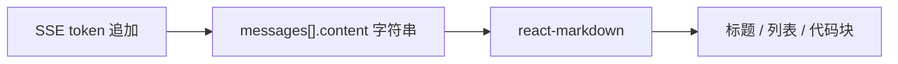
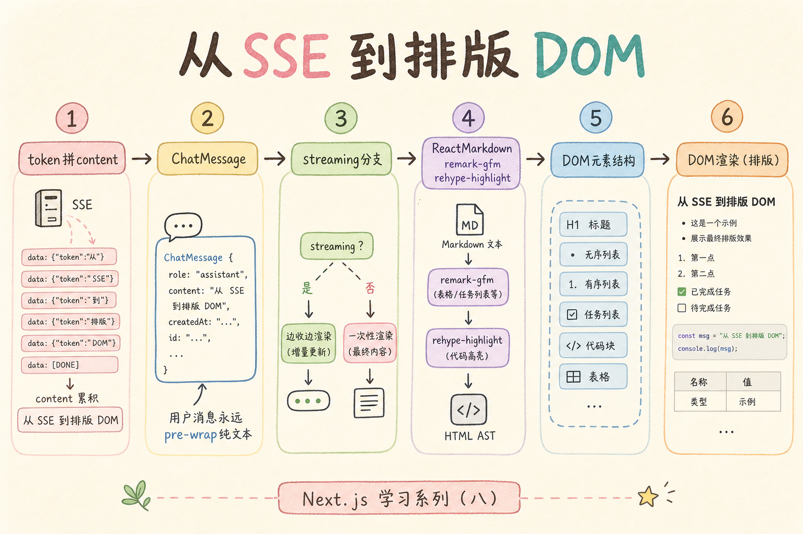
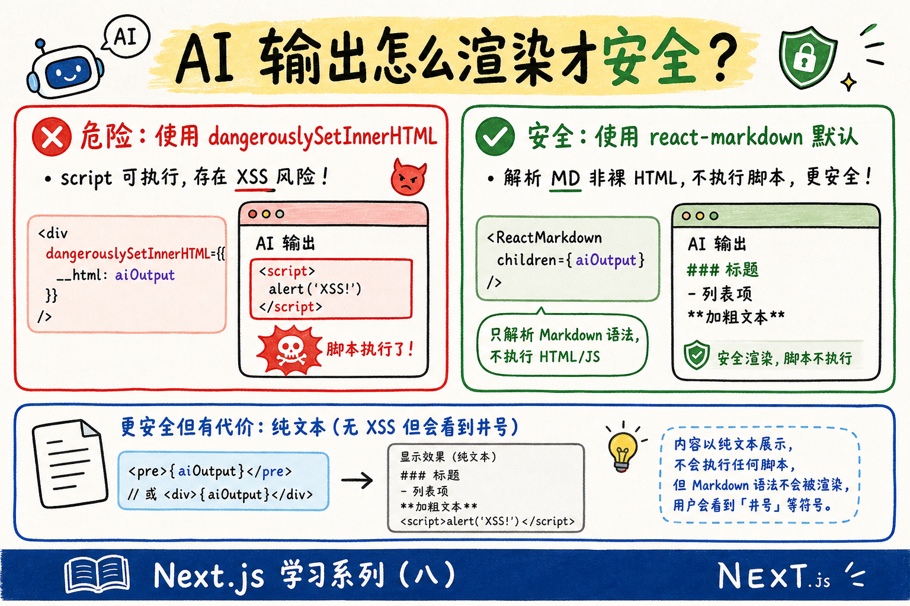
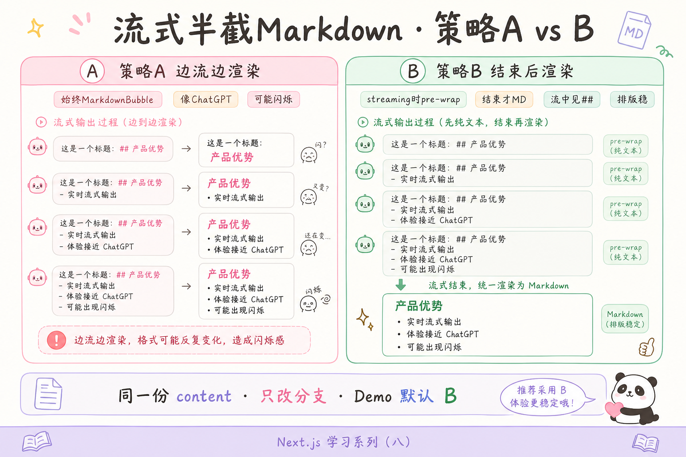

# React 学习系列（八）：Markdown 消息渲染——react-markdown 与代码高亮

> 第七篇的助手气泡用纯文本 `whiteSpace: 'pre-wrap'` 显示——模型一旦输出 **标题、列表、加粗、代码块**，用户看到的是带 `##`、`` ` `` 和 `*` 的「源码」，而不是排版好的阅读体验。大模型和 RAG 回答几乎默认用 **Markdown** 写。这篇是系列第八篇：在 [（七）流式对话](07.sse-streaming-chat.md) 的 `ChatMessage` 上接入 **`react-markdown`**，用 **`remark-gfm`** 支持表格与任务列表，用 **`rehype-highlight`** 给代码块上色，并说明 **流式半截 Markdown** 与 **XSS 安全** 怎么处理。偏概念与能跑通的步骤；引用见 [（九）](09.citation-source-ui.md)，上传见 [（十）](10.file-upload-index-progress.md)。

---

## 目录

1. [前言：助手消息不该是一坨符号](#1-前言助手消息不该是一坨符号)
2. [Markdown 是什么：模型输出的「排版语言」](#2-markdown-是什么模型输出的排版语言)
3. [为什么不用 dangerouslySetInnerHTML](#3-为什么不用-dangerouslysetinnerhtml)
4. [安装依赖与项目准备](#4-安装依赖与项目准备)
5. [最小 MarkdownBubble 组件](#5-最小-markdownbubble-组件)
6. [remark-gfm：表格、删除线、任务列表](#6-remark-gfm表格删除线任务列表)
7. [代码高亮：rehype-highlight](#7-代码高亮rehype-highlight)
8. [流式输出时「半截 Markdown」怎么办](#8-流式输出时半截-markdown-怎么办)
9. [聊天气泡里的样式](#9-聊天气泡里的样式)
10. [改第七篇：用户纯文本、助手 Markdown](#10-改第七篇用户纯文本助手-markdown)
11. [后端：让模拟流吐出 Markdown（可选）](#11-后端让模拟流吐出-markdown可选)
12. [常见陷阱与 FAQ](#12-常见陷阱与-faq)
13. [总结与系列下一步](#13-总结与系列下一步)

---

## 1. 前言：助手消息不该是一坨符号

第七篇典型卡点：

- 模型返回 `## 结论\n\n- 第一点\n\n\`\`\`python\nprint(1)\n\`\`\``，界面原样显示，`#` 和反引号都看得见。
- 听说要用 **Markdown 渲染库**，不知道装哪个、和 JSX 怎么嵌。
- 担心模型输出里夹 **HTML 脚本**——能不能直接 `innerHTML`？
- 流式还在打字时，`**加粗` 只出现一半，排版会闪一下。

**Markdown**：一种用纯文本写标题、列表、链接、代码块的轻量标记语言。  
通俗说：写给机器看的「排版简码」，渲染后像 Word 排好版的文章。

**react-markdown**：把 Markdown 字符串转成 React 组件树的库，默认**不把**未知 HTML 当脚本执行。  
通俗说：专职「把 `## 标题` 变成真正的 `<h2>`」的翻译官。

读完本文，你应该能做到：

1. 说明助手消息为何用 Markdown 渲染、用户消息为何可继续纯文本。
2. 在第七篇 Vite 项目中安装 `react-markdown`、`remark-gfm`、`rehype-highlight` 并跑通。
3. 写出 `MarkdownBubble`，正确显示标题、列表、行内代码与 fenced 代码块。
4. 在流式场景下选择「边流边渲染」或「结束后再 Markdown」策略，并知道各自代价。
5. 说清 **XSS** 风险：为何避免 `dangerouslySetInnerHTML` 和盲目的 `rehype-raw`。

**前置阅读**：

| 篇章 | 必看内容 |
|------|----------|
| [（七）SSE 流式对话](07.sse-streaming-chat.md) | `ChatMessage`、`messages` state、流式追加 `content` |
| [（二）Vite + JSX](02.vite-jsx-first-component.md) | 组件、props、条件渲染 |

**环境**：延续第七篇的 `frontend/` Vite 项目；`npm run dev` 能跑；后端流式接口可不开（用本地假 `content` 字符串也能练）。

### 1.1 本文边界

本篇**先建立地图**，不深究：

- `react-markdown` 每个 AST 节点的定制、`micromark` 原理
- Shiki、Prism 全主题生态、PDF 内代码复制按钮
- 引用溯源 `[1]` 点击跳转——见 [（九）引用溯源 UI](09.citation-source-ui.md)
- LaTeX 公式（`remark-math`，需要再单开一篇）

目标：**助手气泡能正确显示常见 Markdown；代码块有颜色；你知道流式与安全的两条底线。**

### 1.2 动手路径

| 步骤 | 做什么 | 章节 |
|------|--------|------|
| 1 | 用常量字符串试 `MarkdownBubble` | §4–§5 |
| 2 | 加 GFM 与代码高亮 | §6–§7 |
| 3 | 处理 `isStreaming` 显示策略 | §8 |
| 4 | 加 CSS、替换第七篇 `ChatMessage` | §9–§10 |
| 5 | （可选）改后端模拟 Markdown 流 | §11 |

---

## 2. Markdown 是什么：模型输出的「排版语言」

下面同一段话，**源码**与**渲染后**差别很大：

| 你存的字符串（`content`） | 读者应看到的效果 |
|---------------------------|------------------|
| `## RAG 三步` | 大号标题「RAG 三步」 |
| `- 检索\n- 增强\n- 生成` | 三行项目符号列表 |
| `` 用 `useEffect` 拉数据 `` | 行内代码样式包住 `useEffect` |
| ` ```python\nprint("hi")\n``` ` | 带语法着色的代码块 |

**GFM**（GitHub Flavored Markdown，GitHub 风味 Markdown）：在标准 Markdown 上加了表格、删除线、任务列表等扩展。  
通俗说：程序员天天在 README 里写的那套「加强版」。

RAG / 聊天产品里：

- **用户输入**：多为短句，纯文本即可（第七篇写法保留）。
- **助手输出**：长文 + 结构 + 代码 → **应走 Markdown 渲染**。



读图时看数据流：**流式只改字符串**；是否排版由 `ChatMessage` 内是否调用 `react-markdown` 决定——不必为 Markdown 单独改 state 结构。



---

## 3. 为什么不用 dangerouslySetInnerHTML

**XSS**（Cross-Site Scripting，跨站脚本攻击）：把恶意脚本塞进页面，借浏览器执行。  
通俗说：有人在留言里藏 `<script>偷 cookie</script>`，你若原样当 HTML 插入就中招。

React 里对应 API 是 **`dangerouslySetInnerHTML`**（危险地设置内部 HTML）——名字已经提醒：只用于**可信** HTML。

先错后对：

```jsx
// ❌ 危险：模型或用户内容不可信时，绝不要这样
function BadBubble({ content }) {
  return <div dangerouslySetInnerHTML={{ __html: content }} />;
}
// 若 content 含  可能出事
```

```jsx
// ✅ 默认安全路径：react-markdown 把内容当 Markdown 解析，不执行任意 HTML
import ReactMarkdown from 'react-markdown';

function SafeBubble({ content }) {
  return <ReactMarkdown>{content}</ReactMarkdown>;
}
```

| 方式 | 是否适合 AI 输出 | 说明 |
|------|------------------|------|
| 纯文本 `{content}` | 能用但不美观 | 无 XSS，但看见 `#` |
| `dangerouslySetInnerHTML` | ❌ | 除非内容经严格消毒且来源可信 |
| `react-markdown`（默认） | ✅ 推荐 | 转义危险 HTML |
| `react-markdown` + **`rehype-raw`** | ⚠️ 慎用 | 允许原始 HTML 进 DOM，需配合 `rehype-sanitize` |



**rehype-raw**（可选插件）：让 Markdown 里的内联 HTML 标签真的变成 DOM。  
通俗说：打开「HTML 侧门」——产品要渲染富文本时再学消毒；初学 **不要装**。

---

## 4. 安装依赖与项目准备

演示什么：在第七篇 `frontend/` 里安装 Markdown 相关包。  
前置：Node 18+，当前目录为 `frontend/`。

```bash
cd frontend
npm install react-markdown remark-gfm rehype-highlight
```

| 包 | 作用 |
|----|------|
| `react-markdown` | Markdown → React 组件 |
| `remark-gfm` | 表格、删除线、自动链接等 GFM 扩展 |
| `rehype-highlight` | 代码块语法高亮（基于 highlight.js） |

highlight.js 会作为依赖被装上；还需在 CSS 里引入一个主题（§7）。

验证安装：在任意组件里 `import ReactMarkdown from 'react-markdown'` 不报错即可。

---

## 5. 最小 MarkdownBubble 组件

演示什么：接收 `content` 字符串，渲染标题与段落。  
前置：§4 已安装；可先不接 SSE，用常量测试。

新建 `src/components/MarkdownBubble.jsx`：

```jsx
import ReactMarkdown from 'react-markdown';

export function MarkdownBubble({ content }) {
  if (!content) {
    return <span style={{ color: '#6b7280' }}>…</span>;
  }
  return (
    <div className="markdown-bubble">
      <ReactMarkdown>{content}</ReactMarkdown>
    </div>
  );
}
```

在 `App.jsx` 或临时页里试：

```jsx
const sample = `## 你好

这是**加粗**和*斜体*。

- 列表项 A
- 列表项 B
`;

<MarkdownBubble content={sample} />
```

预期：浏览器里出现二级标题、加粗斜体、列表——**不是**带 `##` 的源码。

**ReactMarkdown 的子元素**：花括号里是 **字符串**（或数字），不是 HTML 文件路径。  
通俗说：把 Markdown 当作文本喂给组件，不是 `import` 一个 `.md` 文件（那样是构建工具另一条路，本篇不展开）。

---

## 6. remark-gfm：表格、删除线、任务列表

演示什么：开启 GFM 插件。  
修改 `MarkdownBubble.jsx`：

```jsx
import ReactMarkdown from 'react-markdown';
import remarkGfm from 'remark-gfm';

export function MarkdownBubble({ content }) {
  if (!content) return <span>…</span>;
  return (
    <div className="markdown-bubble">
      <ReactMarkdown remarkPlugins={[remarkGfm]}>{content}</ReactMarkdown>
    </div>
  );
}
```

测试字符串：

```markdown
| 方法 | 延迟 |
|------|------|
| 纯向量 | 低 |
| 混合检索 | 中 |

~~过时方案~~ 推荐 **Hybrid**。

- [x] 已建索引
- [ ] 加重排序
```

预期：表格有边框（需 §9 CSS）；删除线划掉；复选框只作展示（只读聊天一般不交互）。

**remark 与 rehype**：  
- **remark**：处理 Markdown **语法树**（列表、表格等）。  
- **rehype**：处理 **HTML 树**（高亮、消毒等）。  
通俗说：remark 管「Markdown 懂什么」；rehype 管「变成 HTML 后怎么加工」。

---

## 7. 代码高亮：rehype-highlight

演示什么：fenced 代码块显示语言标签与颜色。  
前置：§6 的 `MarkdownBubble`。

### 7.1 接入插件与主题 CSS

在 `MarkdownBubble.jsx` 中：

```jsx
import ReactMarkdown from 'react-markdown';
import remarkGfm from 'remark-gfm';
import rehypeHighlight from 'rehype-highlight';

export function MarkdownBubble({ content }) {
  if (!content) return <span>…</span>;
  return (
    <div className="markdown-bubble">
      <ReactMarkdown
        remarkPlugins={[remarkGfm]}
        rehypePlugins={[rehypeHighlight]}
      >
        {content}
      </ReactMarkdown>
    </div>
  );
}
```

在入口 `src/main.jsx`（或 `App.jsx`）**顶部**引入 highlight.js 主题：

```javascript
import 'highlight.js/styles/github.css';
```

可换成 `github-dark.css` 等，与气泡背景搭配即可。

测试内容：

````markdown
行内：`const x = 1`

块级：

```python
def answer(query: str) -> str:
    return retrieve(query) + generate(query)
```
````

预期：`python` 块有关键字着色；行内 `const` 有浅灰底（依赖 §9 样式）。

### 7.2 先错后对：忘记写语言标签

````markdown
```
print("no lang")
```
````

仍会有代码块样式，但高亮弱——可在 UI 上接受。后端或 Prompt 要求模型 **总是写 ```language** 能改善效果（产品层优化，非 React 必须）。

---

## 8. 流式输出时「半截 Markdown」怎么办

第七篇流式不断 `content += token`。Markdown 是**上下文相关**的：未闭合的 `` ` ``、`**`、` ``` ` 可能导致短暂丑排版。

两种常见策略：

| 策略 | 做法 | 优点 | 缺点 |
|------|------|------|------|
| **A. 边流边渲染** | 始终 `<ReactMarkdown>{content}</ReactMarkdown>` | 与 ChatGPT 类似，即时反馈 | 偶发闪烁、半截列表 |
| **B. 结束后再渲染** | `isStreaming` 时纯文本，结束后 Markdown | 排版稳定 | 流式过程中看见源码符号 |

演示什么：在消息或页级增加 `isStreaming` 标志（第七篇已有页面级 `isStreaming`；也可给**最后一条 assistant** 标 `streaming: true`）。

```jsx
function AssistantContent({ content, streaming }) {
  if (!content) return <span>…</span>;
  if (streaming) {
    // 策略 B：流式中用纯文本，避免半截 Markdown
    return <div style={{ whiteSpace: 'pre-wrap' }}>{content}</div>;
  }
  return <MarkdownBubble content={content} />;
}
```

策略 A（边流边渲染）——更简单，初学默认：

```jsx
function AssistantContent({ content }) {
  return <MarkdownBubble content={content || '…'} />;
}
```

**决策建议**：

- 做 Demo / 教程：**策略 A**，少一个 state 字段。
- 产品演示给业务方看排版：**策略 B** 或流式结束后再 `MarkdownBubble`。
- 进阶：节流 `setState`（第七篇 FAQ）、或用专门 tolerant 解析器——日常可跳过。



---

## 9. 聊天气泡里的样式

`react-markdown` 会生成 `h1`、`p`、`ul`、`pre`、`code` 等标签；默认浏览器样式在窄气泡里往往过大、挤在一起。

演示什么：用一类名包一层，重置排版。  
新建 `src/styles/markdown-bubble.css`（在 `main.jsx` 里 `import './styles/markdown-bubble.css'`）：

```css
.markdown-bubble {
  font-size: 14px;
  line-height: 1.6;
  word-break: break-word;
}

.markdown-bubble h1,
.markdown-bubble h2,
.markdown-bubble h3 {
  margin: 0.6em 0 0.4em;
  font-size: 1.1em;
}

.markdown-bubble h1 { font-size: 1.25em; }

.markdown-bubble p {
  margin: 0.4em 0;
}

.markdown-bubble ul,
.markdown-bubble ol {
  margin: 0.4em 0;
  padding-left: 1.4em;
}

.markdown-bubble pre {
  margin: 0.5em 0;
  padding: 10px 12px;
  border-radius: 8px;
  overflow-x: auto;
  background: #1e1e1e;
  color: #d4d4d4;
}

.markdown-bubble :not(pre) > code {
  padding: 0.15em 0.35em;
  border-radius: 4px;
  background: rgba(0, 0, 0, 0.06);
  font-size: 0.9em;
}

/* 深色助手气泡里行内代码（见 §10）可单独加 .markdown-bubble--on-dark */
```

预期：标题不再巨号；代码块可横向滚动；行内代码有浅底。

用户消息（蓝色气泡）若也要 Markdown（一般不需要），需另调颜色对比度——本篇 **仅助手侧** 用 `MarkdownBubble`。

---

## 10. 改第七篇：用户纯文本、助手 Markdown

**阅读顺序**：先完成 §5–§9，再改第七篇 `ChatMessage.jsx`。

**流式策略说明**：§8 默认推荐 **策略 A**（边流边 `MarkdownBubble`）。下面综合示例采用 **策略 B**（流式中 `pre-wrap`，结束后再 Markdown）——排版更稳；若跟 §8 默认，把 `AssistantContent` 改成始终 `return <MarkdownBubble content={content || '…'} />` 即可。

演示什么：统一入口组件，按 `role` 分支。  
预期：用户消息仍 `pre-wrap`；助手走 `MarkdownBubble`；最后一条在流式中用策略 B 的纯文本。

```jsx
import { MarkdownBubble } from './MarkdownBubble';

export function ChatMessage({ role, content, streaming = false }) {
  const isUser = role === 'user';
  return (
    <div
      style={{
        display: 'flex',
        justifyContent: isUser ? 'flex-end' : 'flex-start',
        marginBottom: 8,
      }}
    >
      <div
        className={isUser ? '' : 'markdown-bubble--assistant'}
        style={{
          maxWidth: '80%',
          padding: '8px 12px',
          borderRadius: 12,
          background: isUser ? '#2563eb' : '#f3f4f6',
          color: isUser ? '#fff' : '#111',
        }}
      >
        {isUser ? (
          <div style={{ whiteSpace: 'pre-wrap' }}>{content}</div>
        ) : (
          <AssistantContent content={content} streaming={streaming} />
        )}
      </div>
    </div>
  );
}

function AssistantContent({ content, streaming }) {
  if (!content) return <span style={{ color: '#6b7280' }}>…</span>;
  if (streaming) {
    return <div style={{ whiteSpace: 'pre-wrap' }}>{content}</div>;
  }
  return <MarkdownBubble content={content} />;
}
```

在 `ChatPage` 里传 `streaming`：

```jsx
{messages.map((m, index) => (
  <ChatMessage
    key={m.id}
    role={m.role}
    content={m.content}
    streaming={
      isStreaming &&
      m.role === 'assistant' &&
      index === messages.length - 1
    }
  />
))}
```

对照上文：`streaming` 为 true 时用策略 B；流结束 `isStreaming === false` 后同一 `content` 自动切到 `MarkdownBubble` 重排——无需复制两份数据。

### 10.1 自测表

| 步骤 | 操作 | 预期 |
|------|------|------|
| 1 | 粘贴 §5 的 `sample` 进 assistant 假数据 | 标题、列表正常 |
| 2 | 粘贴 §7 代码块 | 有 Python 高亮 |
| 3 | 走第七篇 SSE，问「列出三点」 | 流式时纯文本或逐字 MD；结束后排版正确 |
| 4 | 在 content 里试 `<script>alert(1)</script>` | 不应弹窗；显示为文本或忽略 |

---

## 11. 后端：让模拟流吐出 Markdown（可选）

若仍用 [第七篇 §4](07.sse-streaming-chat.md) 的 `fake_llm_stream`，可把回复改成 Markdown 字符串再按字推——前端逻辑不变。

演示什么：只改 Python 里的 `reply` 文本。  
预期：流式结束后看到列表与代码块。

注意：字符串里**不要直接写** Markdown 的三反引号围栏 `` ``` ``，否则会与本文代码块冲突；用缩进表示代码行即可。

```python
reply = f"""## 关于「{user_message}」

简要说明：

1. **检索**：从向量库找片段
2. **增强**：拼进 Prompt
3. **生成**：调用 LLM

示例（Python）：

    chunks = retriever.search(query, k=5)

以上仅为演示 Markdown 流式。"""
```

仍按字符 `yield token` 即可；前端 `MarkdownBubble` 在流式结束后统一渲染结构。

---

## 12. 常见陷阱与 FAQ

### 12.1 陷阱一：把 Markdown 当 HTML 塞给 innerHTML

见 §3。AI 产品默认 **`react-markdown` 默认模式**。

### 12.2 陷阱二：开启 rehype-raw 却不消毒

```jsx
// ❌ 产品级 AI 聊天不要这样写
rehypePlugins={[rehypeRaw]}
```

若业务必须渲染用户提供的 HTML，须另加 **`rehype-sanitize`** 白名单——本篇不展开。

### 12.3 陷阱三：每次 token 都重算整棵 Markdown 树

流式时 `setState` 很频，`react-markdown` 会重新解析——内容短时可接受。卡顿再考虑节流或策略 B（§8）。

### 12.4 陷阱四：用户消息也用 Markdown

用户输入 `*哈哈*` 可能被渲染成斜体——一般 **用户侧保持纯文本** 更安全、更符合预期。

### 12.5 陷阱五：忘记引入 highlight.js 的 CSS

代码块只有 `<pre>` 结构无颜色——检查 `import 'highlight.js/styles/github.css'`。

### 12.6 FAQ

**Q：和 `marked` + `DOMPurify` 比？**  
A：都行。`react-markdown` 与 React 组件模型一体，少一步 `innerHTML` 心理负担。

**Q：能渲染 LaTeX 公式吗？**  
A：加 `remark-math` + `rehype-katex` 和 KaTeX CSS；需要时再开一篇。

**Q：复制代码按钮？**  
A：自定义 `components={{ pre: PreWithCopy }}`——进阶 UI，初学可跳过。

**Q：Markdown 文件当文档站？**  
A：那是 VitePress、Docusaurus 场景；聊天是 **字符串** 渲染，不是文件路由。

### 12.7 动手自检清单

- [ ] 已装 `react-markdown`、`remark-gfm`、`rehype-highlight`  
- [ ] `MarkdownBubble` 能显示标题、列表、表格  
- [ ] 代码块有语法高亮 CSS  
- [ ] 助手用 Markdown、用户用纯文本  
- [ ] 说清为何不用 `dangerouslySetInnerHTML`  
- [ ] 流式策略 A 或 B 选了一种并自测  

---

## 13. 总结与系列下一步

### 13.1 概念速记表

| 概念 | 一句话 |
|------|--------|
| Markdown | 纯文本标记，渲染后变排版 |
| react-markdown | Markdown 字符串 → React 元素 |
| remark-gfm | 表格、任务列表等 GFM |
| rehype-highlight | 代码块语法上色 |
| XSS | 不可信 HTML/脚本注入；忌裸 innerHTML |
| 策略 A/B | 边流边 MD vs 结束后 MD |

### 13.2 决策树

```
助手回复要标题、列表、代码？
└─ 用 react-markdown（+ remark-gfm）

要代码上色？
└─ rehype-highlight + highlight.js CSS

内容来自大模型 / 用户？
└─ 默认不用 rehype-raw；不用 dangerouslySetInnerHTML

流式时排版闪？
└─ 结束后才 Markdown（策略 B）或节流 setState

下一步要做引用 [1]、脚注？
└─ 见 [（九）引用溯源 UI](09.citation-source-ui.md)
```

### 13.3 系列回顾（对话线）

| 篇 | 主题 |
|----|------|
| 七 | 流式 SSE、AbortController、聊天 state |
| 八 | **Markdown 渲染、高亮、安全** |

### 13.4 系列下一步

**React 学习系列（九）**：[引用溯源 UI](09.citation-source-ui.md)——让回答可查证；再读 [（十）文件上传与索引进度](10.file-upload-index-progress.md) 完成 RAG 演示闭环。

### 13.5 可选延伸

- **自定义 components**：复制按钮、链接 `target="_blank"`、`rehype-sanitize`  
- **TypeScript**：`Message` 类型与 `ReactMarkdown` 的 `Components` 类型——见 [（十一）](11.typescript-migration.md)  

---

> **系列定位**：本篇把第七篇的「打字机」升级成「**能读的助手回答**」。下一步读 [（九）引用溯源](09.citation-source-ui.md) 与 [（十）文件上传](10.file-upload-index-progress.md)，与 [路线图](../ENTERPRISE_RAG_ROADMAP.md) 阶段 1～4 对齐。
