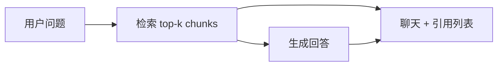

# React 学习系列（九）：引用溯源 UI——SSE 元数据、脚注与侧栏原文

> 第八篇能把助手回答排成 Markdown，但 RAG 产品还要回答：**这句话依据哪份文档、哪一页？** 没有溯源，用户不敢信模型。这篇是系列第九篇：在 [（七）SSE 流式](07.sse-streaming-chat.md) 协议里增加 **`citations` 元数据**，扩展 `readSSEStream` 解析引用列表；在消息 state 里挂 **`citations` 数组**；做 **脚注式引用卡片** 和 **侧栏原文预览**。偏概念与能跑通的步骤；知识库上传见 [（十）文件上传](10.file-upload-index-progress.md)，对应 [企业 RAG 路线图](../ENTERPRISE_RAG_ROADMAP.md) 阶段 4「引用溯源」。

---

## 目录

1. [前言：能读还不够，还要能查证](#1-前言能读还不够还要能查证)
2. [RAG 里「引用」长什么样](#2-rag-里引用长什么样)
3. [协议设计：token 与 citations 分两路](#3-协议设计token-与-citations-分两路)
4. [后端：流结束后再推 citations](#4-后端流结束后再推-citations)
5. [扩展 readSSEStream：onCitations 回调](#5-扩展-readssestreamoncitations-回调)
6. [消息 state：给 assistant 挂上 citations](#6-消息-state给-assistant-挂上-citations)
7. [CitationList：气泡下方的引用卡片](#7-citationlist气泡下方的引用卡片)
8. [侧栏 SourcePanel：点击看原文片段](#8-侧栏-sourcepanel点击看原文片段)
9. [行内 [1] 与 Markdown（了解即可）](#9-行内-1-与-markdown了解即可)
10. [综合实战：聊天 + 侧栏布局](#10-综合实战聊天--侧栏布局)
11. [常见陷阱与 FAQ](#11-常见陷阱与-faq)
12. [总结与系列下一步](#12-总结与系列下一步)

---

## 1. 前言：能读还不够，还要能查证

第八篇典型卡点：

- 助手说「根据公司内部文档……」——用户问：**哪份文档？**
- 不知道引用数据该放 `content` 字符串里，还是单独字段。
- 流式还在吐字时，引用列表该不该先显示？
- 点 `[1]` 想弹原文，不知道 state 放哪、组件怎么拆。

**Grounding**（接地 / 有据生成）：让模型回答尽量**绑在检索到的片段**上，并能指出出处。  
通俗说：不是瞎编，而是「我这句话有凭据」。

**Citation**（引用 / 溯源条目）：一条结构化记录，通常含文档名、页码、原文片段等，供 UI 展示与跳转。  
通俗说：脚注里的「出处卡片」。

读完本文，你应该能做到：

1. 设计最小 `Citation` JSON 形状，并与后端检索 `chunk` 元数据对齐。
2. 在 SSE 流**末尾**推送 `{"citations":[...]}`，与 `token` 字符合流。
3. 扩展 `readSSEStream`，增加 `onCitations` 回调。
4. 实现 `CitationList` + `SourcePanel`，点击引用在侧栏看 `snippet`。
5. 把聊天页改成「主栏对话 + 可选侧栏原文」布局。

**前置阅读**：

| 篇章 | 必看内容 |
|------|----------|
| [（七）SSE 流式对话](07.sse-streaming-chat.md) | `readSSEStream`、`messages`、流式 `handleSend` |
| [（八）Markdown 渲染](08.markdown-message-render.md) | `ChatMessage`、`MarkdownBubble` |

**环境**：第七篇 `frontend/` + `backend/`；Vite 代理 `/api` 与第六篇一致。

### 1.1 本文边界

本篇**先建立地图**，不深究：

- PDF 页内高亮、跳转到真实 PDF 阅读器
- 引用与 Markdown 脚注自动互链（§9 仅概念）
- 多租户权限过滤 `acl` 字段
- 真向量检索与 rerank（后端 RAG 另学）

目标：**模拟流式回答 + 流结束后出现 2 条引用，点击能在侧栏看片段。**

### 1.2 动手路径

| 步骤 | 做什么 | 章节 |
|------|--------|------|
| 1 | 约定 `Citation` JSON | §2–§3 |
| 2 | 改 FastAPI 模拟流 | §4 |
| 3 | 改 `readSSEStream` + `handleSend` | §5–§6 |
| 4 | 做 `CitationList`、`SourcePanel` | §7–§8 |
| 5 | 拼布局并自测 | §10 |

---

## 2. RAG 里「引用」长什么样

检索层通常先拿到 **chunk**（文档切块），再交给 LLM 生成。前端展示的 `Citation` 往往来自 chunk 的元数据：

| 字段 | 含义 | 示例 |
|------|------|------|
| `id` | 本条引用编号，对应脚注 `[1]` | `1` |
| `title` | 文档标题或文件名 | `员工手册.pdf` |
| `source` | 存储路径或 doc_id | `kb/2024/handbook.pdf` |
| `page` | 页码（PDF 常有） | `12` |
| `snippet` | 命中片段原文 | `年假不少于 10 个工作日……` |
| `score` | 相似度（调试台用，可选） | `0.87` |



读图时看**两路输入 UI**：一路是模型写的 `content` 字符串；一路是检索直接给的 `citations` 数组——**不要把大段 snippet 全塞进 Markdown 正文**，否则气泡臃肿、难点击。

### 2.1 和第八篇 Markdown 的分工

| 放哪 | 放什么 |
|------|--------|
| `content` | 模型总结、列表、代码；可含「见引用 [1][2]」 |
| `citations` | 结构化出处，给 `CitationList` / 侧栏 |
| 侧栏 `SourcePanel` | 展示当前选中引用的 `snippet` 全文 |

---

## 3. 协议设计：token 与 citations 分两路

第七篇 SSE 每行形如：

```text
data: {"token":"你"}
```

本篇在**流式正文结束后**再发一行（或多行）元数据：

```text
data: {"citations":[{"id":1,"title":"...","snippet":"..."}]}
```

可选结束标记（与 OpenAI 兼容习惯接近）：

```text
data: [DONE]
```

| 事件类型 | JSON 形状 | 前端处理 |
|----------|-----------|----------|
| 正文字符 | `{ "token": "x" }` | 追加 `content` |
| 引用列表 | `{ "citations": [ ... ] }` | 写入 `message.citations` |
| 结束 | `[DONE]` 或流关闭 | 结束 `isStreaming` |

**为何 citations 放在流末尾？**  
检索结果在生成前往往就确定了；产品可先出字、**最后补脚注**，减少协议复杂度。进阶也可先发 `citations` 再流式 `token`——前后端约定一致即可。

---

## 4. 后端：流结束后再推 citations

演示什么：在第七篇 `fake_llm_stream` 上，先按字推 Markdown 回答，再推 `citations`。  
前置：第七篇 §4 FastAPI 已能跑。

```python
import asyncio
import json
from fastapi import FastAPI
from fastapi.responses import StreamingResponse
from pydantic import BaseModel

app = FastAPI(title="Chat Stream Demo")


class ChatRequest(BaseModel):
    message: str


# 假装检索到的两条 chunk
MOCK_CITATIONS = [
    {
        "id": 1,
        "title": "RAG 入门笔记",
        "source": "docs/rag-intro.md",
        "page": None,
        "snippet": "RAG = Retrieval-Augmented Generation：先检索相关片段，再交给大模型生成。",
    },
    {
        "id": 2,
        "title": "向量检索 FAQ",
        "source": "docs/faq.pdf",
        "page": 3,
        "snippet": "混合检索结合 BM25 与向量相似度，常用 RRF 融合排序。",
    },
]


async def fake_rag_stream(user_message: str):
    answer = f"""## 关于「{user_message}」

简要结论（详见引用 [1][2]）：

1. **RAG** 先检索再生成。
2. 生产环境常用 **混合检索** 提升召回。

以上依据知识库片段整理。"""

    for char in answer:
        yield f"data: {json.dumps({'token': char}, ensure_ascii=False)}\n\n"
        await asyncio.sleep(0.02)

    yield f"data: {json.dumps({'citations': MOCK_CITATIONS}, ensure_ascii=False)}\n\n"
    yield "data: [DONE]\n\n"


@app.post("/api/chat/stream")
async def chat_stream(body: ChatRequest):
    return StreamingResponse(
        fake_rag_stream(body.message),
        media_type="text/event-stream",
        headers={
            "Cache-Control": "no-cache",
            "Connection": "keep-alive",
            "X-Accel-Buffering": "no",
        },
    )
```

预期：`curl -N` 先看到大量 `token`，最后出现含 `citations` 的一行。

**真实 RAG**：`MOCK_CITATIONS` 换成检索服务返回的 chunk 列表；`answer` 换成真 LLM 流式 API 的 token——**推给前端的 JSON 形状可保持不变**。

---

## 5. 扩展 readSSEStream：onCitations 回调

演示什么：在第七篇 `readSSEStream.js` 上增加第二个回调，不破坏原有 `onToken`。  
前置：§3 协议。

```javascript
/**
 * @param {Response} res
 * @param {(token: string) => void} onToken
 * @param {(citations: object[]) => void} [onCitations]
 */
export async function readSSEStream(res, onToken, onCitations) {
  if (!res.ok) {
    const text = await res.text().catch(() => '');
    throw new Error(text || `HTTP ${res.status}`);
  }
  if (!res.body) {
    throw new Error('当前环境不支持流式响应 body');
  }
  const reader = res.body.getReader();
  const decoder = new TextDecoder();
  let buffer = '';

  while (true) {
    const { done, value } = await reader.read();
    if (done) break;
    buffer += decoder.decode(value, { stream: true });

    const parts = buffer.split('\n\n');
    buffer = parts.pop() ?? '';

    for (const part of parts) {
      const line = part.split('\n').find((l) => l.startsWith('data: '));
      if (!line) continue;
      const jsonStr = line.slice('data: '.length).trim();
      if (jsonStr === '[DONE]') continue;

      try {
        const payload = JSON.parse(jsonStr);
        if (payload.token != null) onToken(payload.token);
        if (payload.citations && onCitations) onCitations(payload.citations);
      } catch {
        if (jsonStr) onToken(jsonStr);
      }
    }
  }
}
```

先错后对：

```javascript
// ❌ 把 citations JSON 当 token 拼进正文
if (payload.citations) onToken(JSON.stringify(payload.citations));

// ✅ 分支处理：token 归 content，citations 归专用回调
```

预期：最后一条 `citations` 事件只触发 `onCitations` 一次，不污染 `content`。

---

## 6. 消息 state：给 assistant 挂上 citations

扩展第七篇消息对象：

```javascript
// { id, role, content, citations?: Citation[] }
const assistantMsg = {
  id: assistantId,
  role: 'assistant',
  content: '',
  citations: [], // 先占位，流结束后填充
};
```

在 `handleSend` 里调用扩展后的读流：

```javascript
await readSSEStream(
  res,
  (token) => {
    setMessages((prev) =>
      prev.map((m) =>
        m.id === assistantId ? { ...m, content: m.content + token } : m
      )
    );
  },
  (citations) => {
    setMessages((prev) =>
      prev.map((m) =>
        m.id === assistantId ? { ...m, citations } : m
      )
    );
  }
);
```

**不可变更新**：`citations` 整表替换即可（一次事件给全量）；若后端分批推引用，可改为 `citations: [...m.citations, ...newOnes]`。

侧栏选中状态**不要**写进 `messages`——单独 `useState`（§8），否则每条消息都带 `selectedCitationId` 会臃肿。

---

## 7. CitationList：气泡下方的引用卡片

演示什么：仅 `role === 'assistant'` 且 `citations.length > 0` 时，在 Markdown 气泡下展示可点卡片。  
前置：第八篇 `ChatMessage`。

新建 `src/components/CitationList.jsx`：

```jsx
export function CitationList({ citations, onSelect }) {
  if (!citations?.length) return null;

  return (
    <div style={{ marginTop: 8, display: 'flex', flexDirection: 'column', gap: 6 }}>
      <div style={{ fontSize: 12, color: '#6b7280' }}>参考来源</div>
      {citations.map((c) => (
        <button
          key={c.id}
          type="button"
          onClick={() => onSelect(c)}
          style={{
            textAlign: 'left',
            padding: '8px 10px',
            borderRadius: 8,
            border: '1px solid #e5e7eb',
            background: '#fff',
            cursor: 'pointer',
            fontSize: 13,
          }}
        >
          <span style={{ fontWeight: 600, marginRight: 6 }}>[{c.id}]</span>
          <span>{c.title}</span>
          {c.page != null && (
            <span style={{ color: '#6b7280', marginLeft: 6 }}>p.{c.page}</span>
          )}
        </button>
      ))}
    </div>
  );
}
```

**用 `<button>` 而非 `<div onClick>`**：键盘可聚焦、语义更清晰（无障碍基础习惯）。

在 `ChatMessage` 里组装（在 [第八篇 §10](08.markdown-message-render.md) 的 `ChatMessage` 基础上增加 `citations` 与 `CitationList`）：

```jsx
import { MarkdownBubble } from './MarkdownBubble';
import { CitationList } from './CitationList';

function AssistantContent({ content, streaming }) {
  if (!content) return <span style={{ color: '#6b7280' }}>…</span>;
  if (streaming) {
    return <div style={{ whiteSpace: 'pre-wrap' }}>{content}</div>;
  }
  return <MarkdownBubble content={content} />;
}

export function ChatMessage({
  role,
  content,
  citations,
  streaming = false,
  onCitationSelect,
}) {
  const isUser = role === 'user';
  return (
    <div
      style={{
        display: 'flex',
        justifyContent: isUser ? 'flex-end' : 'flex-start',
        marginBottom: 12,
      }}
    >
      <div style={{ maxWidth: '80%' }}>
        <div
          style={{
            padding: '8px 12px',
            borderRadius: 12,
            background: isUser ? '#2563eb' : '#f3f4f6',
            color: isUser ? '#fff' : '#111',
          }}
        >
          {isUser ? (
            <div style={{ whiteSpace: 'pre-wrap' }}>{content}</div>
          ) : (
            <AssistantContent content={content} streaming={streaming} />
          )}
        </div>
        {!isUser && (
          <CitationList citations={citations} onSelect={onCitationSelect} />
        )}
      </div>
    </div>
  );
}
```

预期：流结束后「参考来源」下出现 `[1] RAG 入门笔记` 等按钮；流式过程中 `citations` 仍为空数组，列表不显示。

---

## 8. 侧栏 SourcePanel：点击看原文片段

**SourcePanel**（原文侧栏）：展示当前选中引用的 `snippet`、`source`、`page`。  
通俗说：脚注点开后的「证据页」。

`ChatPage` 增加状态：

```javascript
const [activeCitation, setActiveCitation] = useState(null);
```

新建 `src/components/SourcePanel.jsx`：

```jsx
export function SourcePanel({ citation, onClose }) {
  if (!citation) {
    return (
      <aside
        style={{
          width: 320,
          borderLeft: '1px solid #e5e7eb',
          padding: 16,
          color: '#9ca3af',
          fontSize: 14,
        }}
      >
        点击回答下方的引用卡片，在此查看原文片段。
      </aside>
    );
  }

  return (
    <aside
      style={{
        width: 320,
        borderLeft: '1px solid #e5e7eb',
        padding: 16,
        overflowY: 'auto',
      }}
    >
      <div style={{ display: 'flex', justifyContent: 'space-between', marginBottom: 12 }}>
        <strong style={{ fontSize: 15 }}>[{citation.id}] {citation.title}</strong>
        <button type="button" onClick={onClose} aria-label="关闭">
          ✕
        </button>
      </div>
      <div style={{ fontSize: 12, color: '#6b7280', marginBottom: 8 }}>
        {citation.source}
        {citation.page != null && ` · 第 ${citation.page} 页`}
      </div>
      <blockquote
        style={{
          margin: 0,
          padding: 12,
          background: '#f9fafb',
          borderLeft: '3px solid #2563eb',
          fontSize: 14,
          lineHeight: 1.6,
          whiteSpace: 'pre-wrap',
        }}
      >
        {citation.snippet}
      </blockquote>
    </aside>
  );
}
```

`onCitationSelect` 实现：

```javascript
function handleCitationSelect(citation) {
  setActiveCitation(citation);
}
```

---

## 9. 行内 [1] 与 Markdown（了解即可）

模型常在正文写「详见 [1]」。两种做法：

| 做法 | 说明 |
|------|------|
| **A. 纯文本** | `[1]` 留在 Markdown 里，用户在下方卡片点 |
| **B. 自定义链接** | `react-markdown` 的 `components.a` 拦截 `href="#citation-1"` |

进阶示例（了解即可，本篇不强制实现）：

```jsx
<ReactMarkdown
  components={{
    a: ({ href, children }) => {
      const m = href?.match(/^#citation-(\d+)$/);
      if (m) {
        return (
          <button type="button" className="citation-link" data-id={m[1]}>
            {children}
          </button>
        );
      }
      return <a href={href} target="_blank" rel="noreferrer">{children}</a>;
    },
  }}
>
  {content}
</ReactMarkdown>
```

需配合 Prompt 让模型输出 `[1](#citation-1)` 形式链接——产品与算法约定问题，初学 **做法 A** 足够演示 RAG 溯源。

---

## 10. 综合实战：聊天 + 侧栏布局

**阅读顺序**：§4–§8 完成后再拼布局。

```jsx
export function ChatPage() {
  const [messages, setMessages] = useState([]);
  const [activeCitation, setActiveCitation] = useState(null);
  // … input, isStreaming, handleSend, handleStop, bottomRef …

  return (
    <div style={{ display: 'flex', height: '100vh' }}>
      <main style={{ flex: 1, display: 'flex', flexDirection: 'column', padding: 16 }}>
        <h1 style={{ margin: '0 0 12px' }}>知识库问答</h1>
        <div style={{ flex: 1, overflowY: 'auto', border: '1px solid #e5e7eb', padding: 12 }}>
          {messages.map((m, index) => (
            <ChatMessage
              key={m.id}
              role={m.role}
              content={m.content}
              citations={m.citations}
              streaming={isStreaming && m.role === 'assistant' && index === messages.length - 1}
              onCitationSelect={setActiveCitation}
            />
          ))}
          <div ref={bottomRef} />
        </div>
        <ChatInput /* … */ />
      </main>
      <SourcePanel citation={activeCitation} onClose={() => setActiveCitation(null)} />
    </div>
  );
}
```

### 10.1 自测表

| 步骤 | 操作 | 预期 |
|------|------|------|
| 1 | 问「什么是 RAG」 | 流式 Markdown 回答 |
| 2 | 流结束 | 气泡下出现 2 条引用卡片 |
| 3 | 点 `[1]` | 右侧显示 snippet |
| 4 | 点 ✕ | 侧栏恢复占位提示 |
| 5 | 再问第二题 | 新回答有新 citations；侧栏可仍显示旧选中（或发送时 `setActiveCitation(null)` 清空） |

发送新问题时是否清空侧栏——产品选择；建议在 `handleSend` 开头 `setActiveCitation(null)`，避免张冠李戴。

---

## 11. 常见陷阱与 FAQ

### 11.1 陷阱一：把 snippet 全塞进 content

正文臃肿、难维护、侧栏重复。检索结果走 **`citations` 字段**。

### 11.2 陷阱二：citations 当 token 拼接

见 §5 先错后对；会出现 JSON 字符串出现在气泡里。

### 11.3 陷阱三：引用 id 与数组下标混用

`id` 应从 1 开始或与模型脚注一致；`key={c.id}` 不要用 `map` 的 `index`，避免重排错乱。

### 11.4 陷阱四：停止生成后仍等待 citations

用户 `abort` 后，后端可能不再发 `citations`——前端 `citations` 保持 `[]` 即可，勿报错。

### 11.5 FAQ

**Q：citations 能走单独 REST 吗？**  
A：可以。`GET /api/chat/{id}/citations` 在流结束后拉取；SSE 一并推更省请求，Demo 够用。

**Q：引用很多怎么办？**  
A：UI 只展示 top 3～5，其余「展开更多」；或侧栏列表滚动。

**Q：怎么和真 pgvector 检索对接？**  
A：后端 retrieve 返回 chunk 元数据映射成同一 JSON；前端本篇代码可不变。

### 11.6 动手自检清单

- [ ] 后端流末尾有 `citations` 事件  
- [ ] `readSSEStream` 分支 `token` / `citations`  
- [ ] `messages` 含 `citations` 数组  
- [ ] `CitationList` 可点击  
- [ ] `SourcePanel` 显示 snippet  
- [ ] 发送新问题时会清空侧栏（若你采用该策略）  

---

## 12. 总结与系列下一步

### 12.1 概念速记表

| 概念 | 一句话 |
|------|--------|
| Grounding | 回答要有检索依据 |
| Citation | 结构化出处条目 |
| token 事件 | 流式正文，拼 `content` |
| citations 事件 | 流末元数据，写 `message.citations` |
| CitationList | 气泡下脚注卡片 |
| SourcePanel | 侧栏原文预览 |

### 12.2 决策树

```
要显示检索来源？
└─ citations 数组 + CitationList

正文与出处怎么分？
└─ content 写总结；snippet 放 citations

协议用什么？
└─ SSE 末尾 {"citations":[...]} 或单独 GET

下一步：用户上传文档进知识库？
└─ 见 [（十）文件上传与索引进度](10.file-upload-index-progress.md)
```

### 12.3 系列回顾（对话 / RAG 线）

| 篇 | 主题 |
|----|------|
| 七 | 流式 SSE、AbortController |
| 八 | Markdown 渲染 |
| 九 | **引用溯源 UI** |

### 12.4 系列下一步

**React 学习系列（十）**：[文件上传与索引进度](10.file-upload-index-progress.md)——知识库入口；工程化续篇见 [（十一）](11.typescript-migration.md)、[（十二）](12.tanstack-query.md)、[（十三）](13.retrieval-debug-console.md)。

### 12.5 可选延伸

- **Zustand**：多会话 + 当前侧栏 citation 全局状态  

---

> **系列定位**：本篇把「能聊」推进到「**能查证**」——企业 RAG 应用层的核心差异。下一篇 [（十）文件上传](10.file-upload-index-progress.md) 补知识库入口；系列目录见 [README.md](README.md)。
