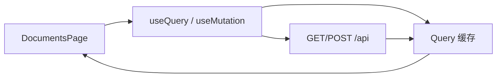

# React 学习系列（十二）：TanStack Query——缓存、轮询与上传 mutation

> 第十篇用 `useEffect` + `setTimeout` 轮询文档列表——能跑，但**离开页面要记得清理**、上传成功后要**手动把新行插进 state**、聊天页和文档页**各拉一遍**相同接口。第三篇也曾说 React Query「遇到项目再学」。这篇是系列第十二篇：接入 **TanStack Query**（常称 React Query），用 **`useQuery`** 替代手写轮询，用 **`useMutation`** 处理上传并在成功后 **`invalidateQueries`** 刷新列表。偏概念与能跑通的步骤；无限滚动、乐观更新等进阶本篇点到为止。建议先读 [（十一）TypeScript](11.typescript-migration.md) 的 `KbDocument` 类型。

---

## 目录

1. [前言：手写 fetch 三板斧不够用了](#1-前言手写-fetch-三板斧不够用了)
2. [TanStack Query 是什么](#2-tanstack-query-是什么)
3. [安装与 QueryClientProvider](#3-安装与-queryclientprovider)
4. [useQuery：文档列表与自动轮询](#4-usequery文档列表与自动轮询)
5. [useMutation：上传文件](#5-usemutation上传文件)
6. [invalidateQueries：改完后刷新缓存](#6-invalidatequeries改完后刷新缓存)
7. [与第三篇三态的对应关系](#7-与第三篇三态的对应关系)
8. [综合实战：改写 DocumentsPage](#8-综合实战改写-documentspage)
9. [常见陷阱与 FAQ](#9-常见陷阱与-faq)
10. [总结与系列下一步](#10-总结与系列下一步)

---

## 1. 前言：手写 fetch 三板斧不够用了

第十篇典型痛点：

- `useEffect` 里轮询，依赖写错就**重复请求**或**漏清理**。
- 上传成功后在 `onUploaded` 里 `setDocuments(prev => [doc, ...prev])`，与服务器列表**可能不一致**。
- 从 `/documents` 切到 `/chat` 再回来，又想**重新拉列表**——手写缓存很麻烦。

**TanStack Query**（原 React Query）：管理服务端状态的 React 库——缓存、`loading`/`error`、后台刷新、轮询、重试。  
通俗说：给每个 API 配一个「智能秘书」，记住上次结果、该刷新时刷新。

**服务端状态**（Server State）：存在后端、前端通过 HTTP 取回的数据（列表、详情、任务进度）。  
通俗说：不是 `useState` 那种只在浏览器里的 UI 状态，而是**问服务器拿来**的。

读完本文，你应该能做到：

1. 用 `QueryClientProvider` 包裹应用。
2. 用 `useQuery` 拉 `GET /api/documents`，并在有 `running` 任务时 `refetchInterval` 轮询。
3. 用 `useMutation` 提交 `FormData` 上传。
4. 上传成功后 `invalidateQueries` 让列表自动更新。
5. 说清 `isLoading` / `isFetching` / `isPending` 与第三篇三态的对应。

**前置阅读**：[（十）文件上传](10.file-upload-index-progress.md)、[（三）useEffect 请求](03.use-effect-data-fetching.md)、[（十一）TS 类型](11.typescript-migration.md)（可选但推荐）。

**环境**：`frontend/`；`npm install @tanstack/react-query`。

### 1.1 本文边界

不深究：React Query Devtools 全功能、Suspense 模式、离线持久化、聊天 `messages` 也全塞进 Query（聊天仍以本地 state 为主）。

目标：**文档列表 + 上传** 改用 Query；聊天页可继续 `useState`（第七～九篇）。

### 1.2 动手路径

| 步骤 | 做什么 | 章节 |
|------|--------|------|
| 1 | 安装 Query、`QueryClientProvider` 包住 `App` | §3 |
| 2 | 建 `api/documents.ts` + `useDocumentsQuery` | §4 |
| 3 | 建 `useUploadDocument`，改 `UploadForm` | §5–§6 |
| 4 | 用完整 `DocumentsPage` 替换第十篇 effect 轮询 | §8 |
| 5 | Network 验证：有 `running` 时 1.5s 轮询，全 `done` 后停止 | §8.2 |

---

## 2. TanStack Query 是什么



读图时看 **Cache**：同一 `queryKey` 的请求会复用结果；`invalidate` 后标记过期并重新拉取。

| 手写（第十篇） | TanStack Query |
|----------------|----------------|
| `useState` + `useEffect` | `useQuery` 自动拉取 |
| `setTimeout` 轮询 + cleanup | `refetchInterval` + 内置停止 |
| POST 后手动改数组 | `useMutation` + `invalidateQueries` |
| 多组件重复 fetch | 同一 `queryKey` 共享缓存 |

**何时不必用**：纯 UI 状态（输入框、侧栏开闭）继续 `useState`；一次性请求且无需缓存可继续第三篇写法。

---

## 3. 安装与 QueryClientProvider

演示什么：全局挂载 Query 客户端。  
前置：Vite React 项目。

```bash
npm install @tanstack/react-query
```

`src/main.tsx`（或 `main.jsx`）：

```tsx
import React from 'react';
import ReactDOM from 'react-dom/client';
import { QueryClient, QueryClientProvider } from '@tanstack/react-query';
import App from './App';
import './index.css';

const queryClient = new QueryClient({
  defaultOptions: {
    queries: {
      staleTime: 30_000, // 30 秒内认为数据「新鲜」，少重复请求
      retry: 1,
    },
  },
});

ReactDOM.createRoot(document.getElementById('root')!).render(
  <React.StrictMode>
    <QueryClientProvider client={queryClient}>
      <App />
    </QueryClientProvider>
  </React.StrictMode>
);
```

**QueryClient**：整个应用的缓存与调度中心。  
**QueryClientProvider**：用 React Context 把 client 传给子组件。

预期：应用能正常启动；尚未使用 `useQuery` 时行为与改前一致。

---

## 4. useQuery：文档列表与自动轮询

演示什么：替代第十篇 `DocumentsPage` 里整段 `useEffect` 轮询。

`src/api/documents.ts`：

```typescript
import type { KbDocument } from '../types/rag';
import { fetchJSON } from '../utils/fetchJSON';

export async function fetchDocuments(): Promise<KbDocument[]> {
  return fetchJSON<KbDocument[]>('/api/documents');
}

export function documentsQueryKey() {
  return ['documents'] as const;
}
```

`queryKey`：缓存的唯一名字，像 `['documents']`；以后可有 `['documents', id]`。

`src/hooks/useDocumentsQuery.ts`：

```tsx
import { useQuery } from '@tanstack/react-query';
import { documentsQueryKey, fetchDocuments } from '../api/documents';
import type { KbDocument } from '../types/rag';

function hasActiveJob(list: KbDocument[]) {
  return list.some((d) => d.status === 'pending' || d.status === 'running');
}

export function useDocumentsQuery() {
  return useQuery({
    queryKey: documentsQueryKey(),
    queryFn: fetchDocuments,
    refetchInterval: (query) => {
      const data = query.state.data;
      if (data && hasActiveJob(data)) return 1500;
      return false; // 无进行中任务 → 停止轮询
    },
  });
}
```

**refetchInterval**：返回毫秒数则定时重拉；返回 `false` 则停——对应第十篇「终态停止轮询」。

在页面中使用：

```tsx
export function DocumentsPage() {
  const { data: documents = [], isLoading, isError, error, isFetching } =
    useDocumentsQuery();

  if (isLoading) return <p>加载中…</p>;
  if (isError) return <p>错误：{(error as Error).message}</p>;

  return (
    <div>
      {isFetching && <span style={{ fontSize: 12 }}>刷新中…</span>}
      <UploadForm />
      <DocumentList documents={documents} />
    </div>
  );
}
```

| 字段 | 含义 |
|------|------|
| `isLoading` | 首次无缓存数据且在加载 |
| `isFetching` | 任意一次请求进行中（含后台刷新） |
| `isError` | 最近一次失败 |
| `data` | 成功后的 `KbDocument[]` |

---

## 5. useMutation：上传文件

演示什么：POST `FormData`，替代 `UploadForm` 内手写 `fetch`。

`multipart` 上传**不要**走 `fetchJSON`（它会默认加 `Content-Type: application/json`）；JSON 接口继续用 `fetchJSON`，文件上传用裸 `fetch` + `FormData`。

`src/api/documents.ts` 追加：

```typescript
export async function uploadDocument(file: File): Promise<KbDocument> {
  const form = new FormData();
  form.append('file', file);
  const res = await fetch('/api/documents', { method: 'POST', body: form });
  if (!res.ok) {
    const text = await res.text().catch(() => '');
    throw new Error(text || `HTTP ${res.status}`);
  }
  return res.json();
}
```

`src/hooks/useUploadDocument.ts`：

```tsx
import { useMutation, useQueryClient } from '@tanstack/react-query';
import { documentsQueryKey, uploadDocument } from '../api/documents';

export function useUploadDocument() {
  const queryClient = useQueryClient();

  return useMutation({
    mutationFn: uploadDocument,
    onSuccess: () => {
      queryClient.invalidateQueries({ queryKey: documentsQueryKey() });
    },
  });
}
```

改写 `UploadForm.tsx`：

```tsx
import { useState } from 'react';
import { useUploadDocument } from '../hooks/useUploadDocument';

export function UploadForm() {
  const [file, setFile] = useState<File | null>(null);
  const upload = useUploadDocument();

  function handleSubmit(e: React.FormEvent) {
    e.preventDefault();
    if (!file || upload.isPending) return;
    upload.mutate(file, {
      onSuccess: () => setFile(null),
    });
  }

  return (
    <form onSubmit={handleSubmit}>
      <input
        type="file"
        accept=".md,.txt,.pdf"
        onChange={(e) => setFile(e.target.files?.[0] ?? null)}
        disabled={upload.isPending}
      />
      <button type="submit" disabled={!file || upload.isPending}>
        {upload.isPending ? '上传中…' : '上传并索引'}
      </button>
      {upload.isError && (
        <p style={{ color: '#b91c1c' }}>{(upload.error as Error).message}</p>
      )}
    </form>
  );
}
```

**useMutation**：管「会改服务器数据」的操作（POST/PUT/DELETE）。  
**isPending**：变异进行中，对应第五篇「submitting」。

---

## 6. invalidateQueries：改完后刷新缓存

**invalidate**（失效）：标记某 `queryKey` 的缓存过期，触发重新 `fetch`。  
通俗说：告诉秘书「那份列表过时了，去重新拿」。

上传成功、删除文档、重建索引后都应 `invalidateQueries({ queryKey: documentsQueryKey() })`。

不必再：

```tsx
// ❌ 与服务器可能不一致
setDocuments((prev) => [doc, ...prev]);
```

```tsx
// ✅ 以服务器为准
onSuccess: () => queryClient.invalidateQueries({ queryKey: documentsQueryKey() })
```

---

## 7. 与第三篇三态的对应关系

| 第三篇手写 | TanStack Query |
|------------|----------------|
| `loading` | `isLoading`（首载） |
| `error` | `isError` + `error` |
| `data` | `data` |
| （无） | `isFetching` 后台刷新 |

聊天 `messages` 仍是 **UI + 流式拼接**，不适合每分钟缓存——继续第七篇 `useState`。

---

## 8. 综合实战：改写 DocumentsPage

**阅读顺序**：§3–§6 完成后再删第十篇里的 `useEffect` 轮询与 `pollVersion`。

### 8.0 与第十篇对照：删什么、留什么

| 第十篇（手写） | 第十二篇（Query） |
|----------------|-------------------|
| `useState(documents)` + `useEffect` 轮询 | `useDocumentsQuery()` |
| `pollVersion` 重启轮询 | `refetchInterval` 看 `data` 自动启停 |
| `handleUploaded` 手动 `setDocuments` | `invalidateQueries` 以服务器为准 |
| `UploadForm` 的 `onUploaded` 回调 | `UploadForm` 内部 `useUploadDocument` |
| `DocumentList.jsx` 可保留 | 建议改 `.tsx` 并给 `documents` 加类型 |

下面给出**可整文件替换**的 `DocumentList.tsx`、`DocumentsPage.tsx`。`UploadForm` 见 §5；`DocumentList` 样式与 [第十篇 §7](10.file-upload-index-progress.md) 相同，仅补上 TypeScript。

### 8.1 完整 `DocumentList.tsx`

演示什么：列表 UI 不变，props 使用 `KbDocument[]`。  
前置：[第十一篇 `types/rag.ts`](11.typescript-migration.md) 的 `KbDocument`、`JobStatus`。

```tsx
import type { JobStatus, KbDocument } from '../types/rag';

const STATUS_LABEL: Record<JobStatus, string> = {
  pending: '排队中',
  running: '索引中',
  done: '已完成',
  failed: '失败',
};

interface DocumentListProps {
  documents: KbDocument[];
}

export function DocumentList({ documents }: DocumentListProps) {
  if (!documents.length) {
    return <p style={{ color: '#6b7280' }}>暂无文档，请先上传。</p>;
  }

  return (
    <ul style={{ listStyle: 'none', padding: 0, margin: 0 }}>
      {documents.map((d) => (
        <li
          key={d.id}
          style={{
            border: '1px solid #e5e7eb',
            borderRadius: 8,
            padding: 12,
            marginBottom: 8,
          }}
        >
          <div style={{ display: 'flex', justifyContent: 'space-between' }}>
            <strong>{d.filename}</strong>
            <span>{STATUS_LABEL[d.status] ?? d.status}</span>
          </div>
          {(d.status === 'pending' || d.status === 'running') && (
            <div style={{ marginTop: 8 }}>
              <div
                style={{
                  height: 6,
                  background: '#e5e7eb',
                  borderRadius: 3,
                  overflow: 'hidden',
                }}
              >
                <div
                  style={{
                    width: `${d.progress}%`,
                    height: '100%',
                    background: '#2563eb',
                    transition: 'width 0.3s',
                  }}
                />
              </div>
              <span style={{ fontSize: 12, color: '#6b7280' }}>{d.progress}%</span>
            </div>
          )}
          {d.status === 'failed' && d.error && (
            <p style={{ color: '#b91c1c', fontSize: 13, marginTop: 8 }}>{d.error}</p>
          )}
        </li>
      ))}
    </ul>
  );
}
```

`Record<JobStatus, string>` 保证四种 `status` 都有中文标签——漏写一种时 `tsc` 会报错。

### 8.2 完整 `DocumentsPage.tsx`

演示什么：删掉第十篇整段 `useEffect` / `pollVersion`，改用 §4–§5 的 hooks。  
前置：`useDocumentsQuery`、`useUploadDocument`、`UploadForm`（§5）、`DocumentList`（§8.1）。

```tsx
import { Link } from 'react-router-dom';
import { DocumentList } from '../components/DocumentList';
import { UploadForm } from '../components/UploadForm';
import { useDocumentsQuery } from '../hooks/useDocumentsQuery';

export function DocumentsPage() {
  const { data: documents = [], isLoading, isError, error, isFetching } =
    useDocumentsQuery();

  if (isLoading) {
    return (
      <div style={{ maxWidth: 640, margin: '0 auto', padding: 24 }}>
        <p>加载中…</p>
      </div>
    );
  }

  if (isError) {
    return (
      <div style={{ maxWidth: 640, margin: '0 auto', padding: 24 }}>
        <p style={{ color: '#b91c1c' }}>加载失败：{(error as Error).message}</p>
      </div>
    );
  }

  return (
    <div style={{ maxWidth: 640, margin: '0 auto', padding: 24 }}>
      <div
        style={{
          display: 'flex',
          justifyContent: 'space-between',
          alignItems: 'center',
        }}
      >
        <h1>知识库文档</h1>
        <Link to="/chat">去问答 →</Link>
      </div>
      {isFetching && (
        <p style={{ fontSize: 12, color: '#6b7280', margin: '0 0 8px' }}>刷新中…</p>
      )}
      <UploadForm />
      <DocumentList documents={documents} />
    </div>
  );
}
```

与第十篇对比：不再有 `onUploaded` 往父组件塞假数据——上传成功后 `invalidateQueries` 触发重拉，列表与后端一致。

路由不变：

```tsx
<Route path="/documents" element={<DocumentsPage />} />
```

### 8.3 验收步骤（与第十篇 §8.2 对齐）

| 步骤 | 操作 | 预期 |
|------|------|------|
| 1 | 两端启动，`/documents` | 首屏 `isLoading` 后出列表 |
| 2 | 上传 `.md` | `POST` 201；列表出现新行 |
| 3 | 观察 Network | 有 `running` 时每 ~1.5s 一次 `GET /api/documents` |
| 4 | 全部 `done` | 轮询停止（无持续 GET） |
| 5 | 切到 `/chat` 再回 `/documents` | 列表从缓存秒开，可后台 `isFetching` 刷新 |

可选：开发时安装 Devtools（了解即可）：

```bash
npm install -D @tanstack/react-query-devtools
```

```tsx
import { ReactQueryDevtools } from '@tanstack/react-query-devtools';
// 放在 QueryClientProvider 内
<ReactQueryDevtools initialIsOpen={false} />
```

### 8.4 动手自检清单

- [ ] `main.tsx` 有 `QueryClientProvider`
- [ ] `useDocumentsQuery` 替换 effect 轮询（无 `pollVersion`）
- [ ] `UploadForm` 用 `useUploadDocument`，无 `onUploaded` 手改数组
- [ ] 上传后列表自动出现新行且 `progress` 递增
- [ ] 全部 `done` 后 Network 不再每 1.5s 刷 `GET /api/documents`
- [ ] `DocumentList.tsx` / `DocumentsPage.tsx` 已替换为 §8.1–§8.2 完整版

---

## 9. 常见陷阱与 FAQ

### 9.1 陷阱一：忘记 Provider

`useQuery` 报错 `No QueryClient set` → 检查 `QueryClientProvider` 是否包住 `App`。

### 9.2 陷阱二：queryKey 不稳定

```tsx
// ❌ 每次渲染新数组引用
queryKey: ['documents', { t: Date.now() }]

// ✅
queryKey: documentsQueryKey()
```

### 9.3 陷阱三：refetchInterval 恒为 1500

无运行中任务仍轮询——用 §4 的 `hasActiveJob` 判断返回 `false`。

### 9.4 陷阱四：把所有 state 都塞进 Query

输入框、流式 `messages`、`activeCitation` 仍用 `useState`。

### 9.5 FAQ

**Q：和 SWR 比？**  
A：同类库；TanStack Query 功能全、文档多，企业项目常见。

**Q：聊天历史要持久化？**  
A：`useQuery` 拉 `GET /api/sessions`；发送仍 `POST` + 本地追加，进阶话题。

**Q：第十篇的 cleanup 还要吗？**  
A：列表轮询交给 Query 后，**不必**再手写 `clearTimeout` cleanup。

### 9.6 动手自检清单

- [ ] Provider 已配置  
- [ ] `useQuery` + 条件 `refetchInterval`  
- [ ] `useMutation` 上传  
- [ ] `invalidateQueries` 刷新列表  
- [ ] 理解 loading vs fetching  

---

## 10. 总结与系列下一步

### 10.1 概念速记表

| 概念 | 一句话 |
|------|--------|
| QueryClient | 全局缓存与请求调度 |
| queryKey | 缓存键，如 `['documents']` |
| useQuery | GET 类、自动缓存与轮询 |
| useMutation | POST 等写操作 |
| invalidateQueries | 标记过期并重拉 |
| staleTime | 多久内算「新鲜」 |

### 10.2 决策树

```
重复请求同一 GET？
└─ useQuery + queryKey

POST 后要更新列表？
└─ useMutation + invalidateQueries

索引进行中要轮询？
└─ refetchInterval 动态返回 1500 或 false

流式聊天 messages？
└─ 继续 useState（第七篇）

检索 top-k 调试？
└─ [（十三）检索调试台](13.retrieval-debug-console.md)
```

### 10.4 系列下一步

**React 学习系列（十三）**：[检索调试台——top-k 与 score](13.retrieval-debug-console.md)——RAG 排障收束篇。

### 10.5 可选延伸

- **乐观更新**：上传先在列表插「假行」  
- **useQuery 拉聊天历史**  
- **Zustand**：多会话 id + Query 结合  

---

> **系列定位**：本篇把第十篇的「能轮询」升级为「**省心的服务器状态**」。下一篇 [（十三）检索调试台](13.retrieval-debug-console.md) 完成 RAG **排障向** UI；全系列见 [README.md](README.md)。
