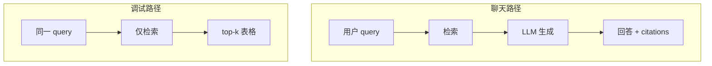

# React 学习系列（十三）：检索调试台——top-k、score 与 bad case 排查

> 聊天页答错了，是 **检索没召回** 还是 **模型胡编**？没有调试台只能猜。路线图 F2 #199 要求能「输入 query 看 top-k」。这篇是系列第十三篇（RAG 排障收束）：后端提供 **`POST /api/debug/retrieve`** 返回带 **score** 的 chunk 列表；前端做 **查询输入 + 结果表格**，点击行可对照 [（九）Citation](09.citation-source-ui.md) 的 `snippet` 形状。偏概念与能跑通的步骤；真向量库、混合检索见路线图阶段 2。推荐 [（十一）类型](11.typescript-migration.md)、[（十二）Query](12.tanstack-query.md)。

---

## 目录

1. [前言：聊天界面看不出检索质量](#1-前言聊天界面看不出检索质量)
2. [调试台在 RAG 排障里站哪](#2-调试台在-rag-排障里站哪)
3. [API 设计：RetrieveResult 形状](#3-api-设计retrieveresult-形状)
4. [后端：模拟 top-k 检索](#4-后端模拟-top-k-检索)
5. [类型与 API 函数](#5-类型与-api-函数)
6. [RetrieveDebugPage：输入与提交](#6-retrievedebugpage输入与提交)
7. [结果表格：score、标题、片段预览](#7-结果表格score标题片段预览)
8. [用 useMutation 发调试请求](#8-用-usemutation-发调试请求)
9. [与聊天页串联：从 bad case 跳转](#9-与聊天页串联从-bad-case-跳转)
10. [常见陷阱与 FAQ](#10-常见陷阱与-faq)
11. [总结与系列收束](#11-总结与系列收束)

---

## 1. 前言：聊天界面看不出检索质量

第九篇典型后续问题：

- 用户问「年假几天」，回答离谱——是 **库里没 chunk** 还是 **模型没听话**？
- 想调 `top_k`、`score` 阈值，只有后端日志，**产品同学看不到**。
- 引用 `[1]` 的 `snippet` 和调试结果对不上。

**检索调试台**（Retrieval Debug Console）：内部工具页，输入与聊天相同的 **query**，直接展示 **top-k 召回片段与分数**，不经过 LLM 生成。  
通俗说：只打开「搜索引擎结果页」，不打开「写作文的模型」。

**top-k**：检索时取得分最高的前 **k** 条片段。  
通俗说：只关心最像的前 5 条，不是全库翻一遍。

读完本文，你应该能做到：

1. 定义 `RetrieveHit`（含 `score`、`snippet`、`document_id` 等）。
2. 实现 FastAPI `POST /api/debug/retrieve` 返回模拟排序结果。
3. 做 `RetrieveDebugPage`：输入 query、展示表格、点击看完整 snippet。
4. 用 `useMutation` 触发调试请求（或 `useQuery` + 手动 `enabled`，本篇用 mutation 更贴「点按钮才查」）。
5. 说清调试台与聊天页 citations 的字段如何对齐。

**前置阅读**：[（九）引用](09.citation-source-ui.md)、[（十二）TanStack Query](12.tanstack-query.md)、[（四）Router](04.react-router-list-detail.md)。

**环境**：`frontend/` + `backend/`；第十二篇 Query 已配置更佳。

### 1.1 本文边界

不深究：混合检索 BM25+向量、reranker 可视化、生产环境权限（调试台应仅内网或管理员）。

目标：**输入问题 → 表格显示 ≥3 条命中 + score → 点击行在下方展开 snippet。**

---

## 2. 调试台在 RAG 排障里站哪



读图时对比：**调试路径不调用 LLM**——若这里就空，聊天必然胡编，应修索引或 query；这里有命中但聊天仍错，应修 Prompt 或生成。

| 现象 | 调试台先看 |
|------|------------|
| 0 条命中 | 文档没入库、chunk 太大、query 不匹配 |
| 有命中但 score 低 | top_k、阈值、embedding 模型 |
| 命中正确但回答错 | 生成/Prompt 问题 |
| 命中与 citation 不一致 | 前后端字段映射或缓存 |

---

## 3. API 设计：RetrieveResult 形状

与第九篇 `Citation` 对齐，并加检索专属字段：

```typescript
// src/types/rag.ts 追加
export interface RetrieveHit {
  rank: number;           // 1-based 排名
  score: number;          // 0~1 或相似度，前后端约定即可
  chunk_id: string;
  document_id: string;
  title: string;
  source: string;
  page?: number | null;
  snippet: string;
}

export interface RetrieveDebugResponse {
  query: string;
  top_k: number;
  hits: RetrieveHit[];
  took_ms: number;
}
```

**score**：数值越大越相关（或越小越相关——**全文统一一种语义**并在 UI 标注）。本篇采用 **越大越好**，范围 0～1 模拟。

---

## 4. 后端：模拟 top-k 检索

演示什么：不连真向量库，用关键词简单打分排序。  
`backend/main.py` 追加：

```python
import re
import time
from pydantic import BaseModel, Field

MOCK_CHUNKS = [
    {
        "chunk_id": "c1",
        "document_id": "d1",
        "title": "RAG 入门笔记",
        "source": "docs/rag-intro.md",
        "page": None,
        "snippet": "RAG = Retrieval-Augmented Generation：先检索相关片段，再交给大模型生成。",
    },
    {
        "chunk_id": "c2",
        "document_id": "d2",
        "title": "向量检索 FAQ",
        "source": "docs/faq.pdf",
        "page": 3,
        "snippet": "混合检索结合 BM25 与向量相似度，常用 RRF 融合排序。",
    },
    {
        "chunk_id": "c3",
        "document_id": "d3",
        "title": "员工手册",
        "source": "docs/handbook.pdf",
        "page": 12,
        "snippet": "年假不少于 10 个工作日，需提前在系统申请。",
    },
]


class RetrieveDebugRequest(BaseModel):
    query: str = Field(min_length=1)
    top_k: int = Field(default=5, ge=1, le=20)


def _mock_score(query: str, snippet: str) -> float:
    """极简打分：query 词在 snippet 中出现次数 → 归一化到 0~1"""
    words = [w for w in re.split(r"\W+", query.lower()) if len(w) > 1]
    if not words:
        return 0.0
    text = snippet.lower()
    hits = sum(1 for w in words if w in text)
    return min(1.0, hits / len(words))


@app.post("/api/debug/retrieve")
def debug_retrieve(body: RetrieveDebugRequest):
    t0 = time.perf_counter()
    scored = []
    for ch in MOCK_CHUNKS:
        s = _mock_score(body.query, ch["snippet"])
        scored.append((s, ch))
    scored.sort(key=lambda x: x[0], reverse=True)
    top = scored[: body.top_k]

    hits = []
    for i, (score, ch) in enumerate(top, start=1):
        hits.append(
            {
                "rank": i,
                "score": round(score, 4),
                "chunk_id": ch["chunk_id"],
                "document_id": ch["document_id"],
                "title": ch["title"],
                "source": ch["source"],
                "page": ch.get("page"),
                "snippet": ch["snippet"],
            }
        )

    took_ms = int((time.perf_counter() - t0) * 1000)
    return {
        "query": body.query,
        "top_k": body.top_k,
        "hits": hits,
        "took_ms": took_ms,
    }
```

自测：

```bash
curl -X POST http://localhost:8000/api/debug/retrieve \
  -H "Content-Type: application/json" \
  -d "{\"query\":\"年假\",\"top_k\":3}"
```

预期：`员工手册` 片段 `score` 相对较高。

---

## 5. 类型与 API 函数

`src/api/retrieve.ts`：

```typescript
import type { RetrieveDebugResponse } from '../types/rag';
import { fetchJSON } from '../utils/fetchJSON';

export interface RetrieveDebugParams {
  query: string;
  top_k?: number;
}

export async function debugRetrieve(
  params: RetrieveDebugParams,
): Promise<RetrieveDebugResponse> {
  return fetchJSON<RetrieveDebugResponse>('/api/debug/retrieve', {
    method: 'POST',
    headers: { 'Content-Type': 'application/json' },
    body: JSON.stringify({
      query: params.query,
      top_k: params.top_k ?? 5,
    }),
  });
}
```

---

## 6. RetrieveDebugPage：输入与提交

演示什么：受控输入 + top_k 数字 + 提交按钮。  
新建 `src/pages/RetrieveDebugPage.tsx`：

```tsx
import { useState } from 'react';
import { Link } from 'react-router-dom';
import { useRetrieveDebug } from '../hooks/useRetrieveDebug';
import { RetrieveHitTable } from '../components/RetrieveHitTable';

export function RetrieveDebugPage() {
  const [query, setQuery] = useState('');
  const [topK, setTopK] = useState(5);
  const debug = useRetrieveDebug();

  function handleSearch(e: React.FormEvent) {
    e.preventDefault();
    if (!query.trim()) return;
    debug.mutate({ query: query.trim(), top_k: topK });
  }

  return (
    <div style={{ maxWidth: 900, margin: '0 auto', padding: 24 }}>
      <div style={{ display: 'flex', justifyContent: 'space-between' }}>
        <h1>检索调试台</h1>
        <Link to="/chat">← 返回聊天</Link>
      </div>
      <p style={{ color: '#6b7280', fontSize: 14 }}>
        只测检索、不调用 LLM。用于排查「没召回」类 bad case。
      </p>

      <form onSubmit={handleSearch} style={{ display: 'flex', gap: 8, marginBottom: 16 }}>
        <input
          value={query}
          onChange={(e) => setQuery(e.target.value)}
          placeholder="输入与聊天相同的 query…"
          style={{ flex: 1, padding: 8 }}
        />
        <label>
          top_k
          <input
            type="number"
            min={1}
            max={20}
            value={topK}
            onChange={(e) => setTopK(Number(e.target.value))}
            style={{ width: 56, marginLeft: 4 }}
          />
        </label>
        <button type="submit" disabled={debug.isPending}>
          {debug.isPending ? '检索中…' : '检索'}
        </button>
      </form>

      {debug.isError && (
        <p style={{ color: '#b91c1c' }}>{(debug.error as Error).message}</p>
      )}

      {debug.data && (
        <>
          <p style={{ fontSize: 13, color: '#6b7280' }}>
            query: 「{debug.data.query}」 · {debug.data.hits.length} 条 ·{' '}
            {debug.data.took_ms} ms
          </p>
          <RetrieveHitTable hits={debug.data.hits} />
        </>
      )}
    </div>
  );
}
```

路由：

```tsx
<Route path="/debug/retrieve" element={<RetrieveDebugPage />} />
```

---

## 7. 结果表格：score、标题、片段预览

`src/components/RetrieveHitTable.tsx`：

```tsx
import { Fragment, useState } from 'react';
import type { RetrieveHit } from '../types/rag';

export function RetrieveHitTable({ hits }: { hits: RetrieveHit[] }) {
  const [expandedId, setExpandedId] = useState<string | null>(null);

  if (!hits.length) {
    return <p>无命中。请检查知识库是否已索引或换 query。</p>;
  }

  return (
    <table style={{ width: '100%', borderCollapse: 'collapse', fontSize: 14 }}>
      <thead>
        <tr style={{ textAlign: 'left', borderBottom: '2px solid #e5e7eb' }}>
          <th style={{ padding: 8 }}>#</th>
          <th style={{ padding: 8 }}>score</th>
          <th style={{ padding: 8 }}>文档</th>
          <th style={{ padding: 8 }}>片段预览</th>
        </tr>
      </thead>
      <tbody>
        {hits.map((h) => (
          <Fragment key={h.chunk_id}>
            <tr
              onClick={() =>
                setExpandedId((id) => (id === h.chunk_id ? null : h.chunk_id))
              }
              style={{
                cursor: 'pointer',
                borderBottom: '1px solid #f3f4f6',
                background: expandedId === h.chunk_id ? '#f9fafb' : undefined,
              }}
            >
              <td style={{ padding: 8 }}>{h.rank}</td>
              <td style={{ padding: 8 }}>{h.score.toFixed(3)}</td>
              <td style={{ padding: 8 }}>
                {h.title}
                {h.page != null && ` · p.${h.page}`}
              </td>
              <td style={{ padding: 8, color: '#4b5563' }}>
                {h.snippet.slice(0, 60)}
                {h.snippet.length > 60 ? '…' : ''}
              </td>
            </tr>
            {expandedId === h.chunk_id && (
              <tr>
                <td colSpan={4} style={{ padding: '8px 12px 16px' }}>
                  <pre
                    style={{
                      margin: 0,
                      whiteSpace: 'pre-wrap',
                      background: '#f3f4f6',
                      padding: 12,
                      borderRadius: 8,
                    }}
                  >
                    {h.snippet}
                  </pre>
                  <div style={{ fontSize: 12, color: '#6b7280', marginTop: 6 }}>
                    chunk: {h.chunk_id} · source: {h.source}
                  </div>
                </td>
              </tr>
            )}
          </Fragment>
        ))}
      </tbody>
    </table>
  );
}
```

**片段预览**：表格里只显示前 60 字，点击展开全文——与第九篇侧栏 `snippet` 对照习惯一致。

先错对对：`map` 返回多行时，**`key` 写在 `Fragment` 上**（`key={h.chunk_id}`），不要只写在内部 `<tr>`；也可拆成子组件 `RetrieveHitRow`。

---

## 8. 用 useMutation 发调试请求

`src/hooks/useRetrieveDebug.ts`：

```tsx
import { useMutation } from '@tanstack/react-query';
import { debugRetrieve } from '../api/retrieve';

export function useRetrieveDebug() {
  return useMutation({
    mutationFn: debugRetrieve,
  });
}
```

为何用 **mutation** 而非 query：调试是「用户点检索才发」，不是进页自动拉；`queryKey` 也可用 `enabled: false` + `refetch`，但 mutation 语义更直观。

若无第十二篇，可临时手写：

```tsx
const [data, setData] = useState<RetrieveDebugResponse | null>(null);
// handleSearch 里 await debugRetrieve(...)
```

---

## 9. 与聊天页串联：从 bad case 跳转

在 `ChatPage` 顶栏加链接（内部工具）：

```tsx
<Link to="/debug/retrieve" style={{ fontSize: 14 }}>
  检索调试
</Link>
```

进阶：把当前输入框 `query` 通过 **Router state** 带给调试台：

```tsx
// ChatPage
<Link to="/debug/retrieve" state={{ presetQuery: input }}>
  用当前问题调试检索
</Link>

// RetrieveDebugPage
import { useEffect } from 'react';
import { useLocation } from 'react-router-dom';

const location = useLocation();
useEffect(() => {
  const q = (location.state as { presetQuery?: string })?.presetQuery;
  if (q) setQuery(q);
}, [location.state]);
```

**RetrieveHit → Citation**：调试命中可映射为聊天引用形状，供对比：

```typescript
export function hitToCitation(h: RetrieveHit): Citation {
  return {
    id: h.rank,
    title: h.title,
    source: h.source,
    page: h.page,
    snippet: h.snippet,
    score: h.score,
  };
}
```

---

## 10. 常见陷阱与 FAQ

### 10.1 陷阱一：调试台对公网开放

应加登录或内网 VPN；本篇 Demo 仅限本地开发。

### 10.2 陷阱二：score 方向不一致

后端越大越好，UI 却按升序排——全文约定一种并在表头注释「↑ 越相关」。

### 10.3 陷阱三：用聊天接口测检索

`POST /api/chat/stream` 混了生成，无法单独评检索——**必须**独立 debug API。

### 10.4 FAQ

**Q：真向量库怎么接？**  
A：替换 `_mock_score` 为 embedding + 向量搜索；**响应 JSON 形状不变**，前端少改。

**Q：要显示 BM25 vs 向量两列吗？**  
A：阶段 2 混合检索进阶；初学一列 `score` 即可。

**Q：和 RAGAS 关系？**  
A：RAGAS 是离线评测；调试台是在线人工看召回，互补。

### 10.5 动手自检清单

- [ ] `POST /api/debug/retrieve` curl 通  
- [ ] 表格显示 rank / score / 预览  
- [ ] 点击展开 snippet  
- [ ] 与 `/chat` 路由互链  
- [ ] `RetrieveHit` 与 `Citation` 字段能对应  

---

## 11. 总结与系列收束

### 11.1 概念速记表

| 概念 | 一句话 |
|------|--------|
| 检索调试台 | 只测召回，不生成 |
| top-k | 取得分前 k 条 |
| score | 相关性分数，语义要统一 |
| RetrieveHit | 单条命中 + 元数据 |
| bad case | 先调试台再判检索/生成 |

### 11.2 React 系列能力地图（1～13）

```text
基础 1–2 → 数据 3 → CRUD 4–6 → RAG UI 7–10 → 工程 11–12 → 排障 13
```

| 你想交付… | 重点篇章 |
|-----------|----------|
| 会写 React 页面 | 1–5 |
| 能联调 Python API | 3、6 |
| RAG 演示产品 | 7–10、13 |
| 可维护前端工程 | 11–12 |

### 11.3 系列收束与进阶

第十三篇为 React 系列 **主线收束**。回顾 1～13 目录与阅读路线见 [react/README.md](README.md)；未单独成篇的主题见 README「进阶可选」（JWT、Zustand、部署等）。

---

> **系列定位**：第十三篇为 React 系列的 **RAG 排障收束**。配合 [路线图](../ENTERPRISE_RAG_ROADMAP.md) 阶段 4 验收：上传 → 索引 → 问答 → 引用 → **检索可观测**。主线完结后查 [系列 README](README.md) 选进阶主题。
