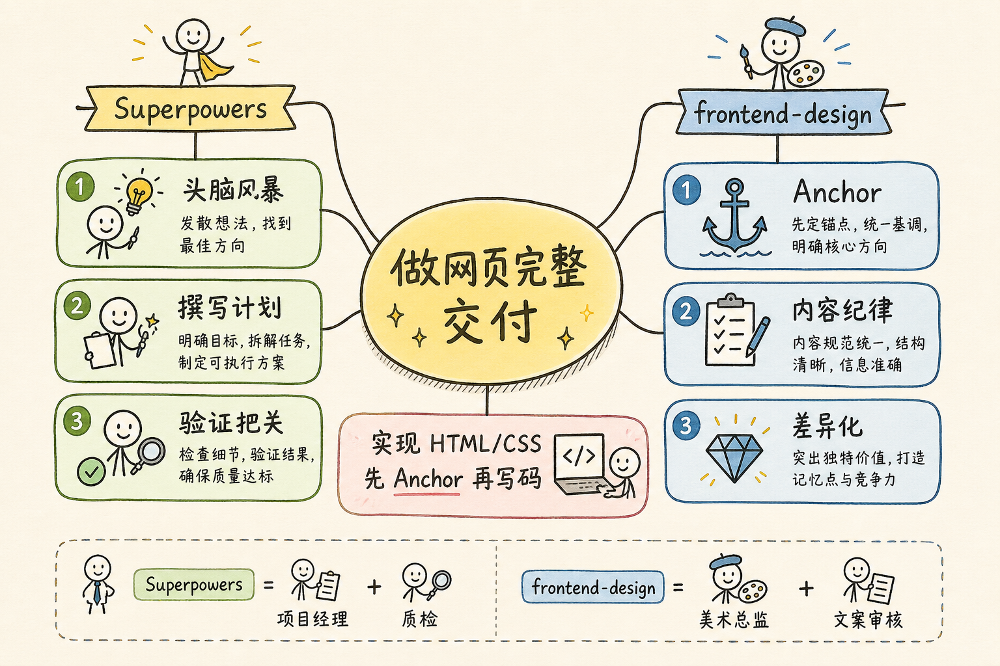
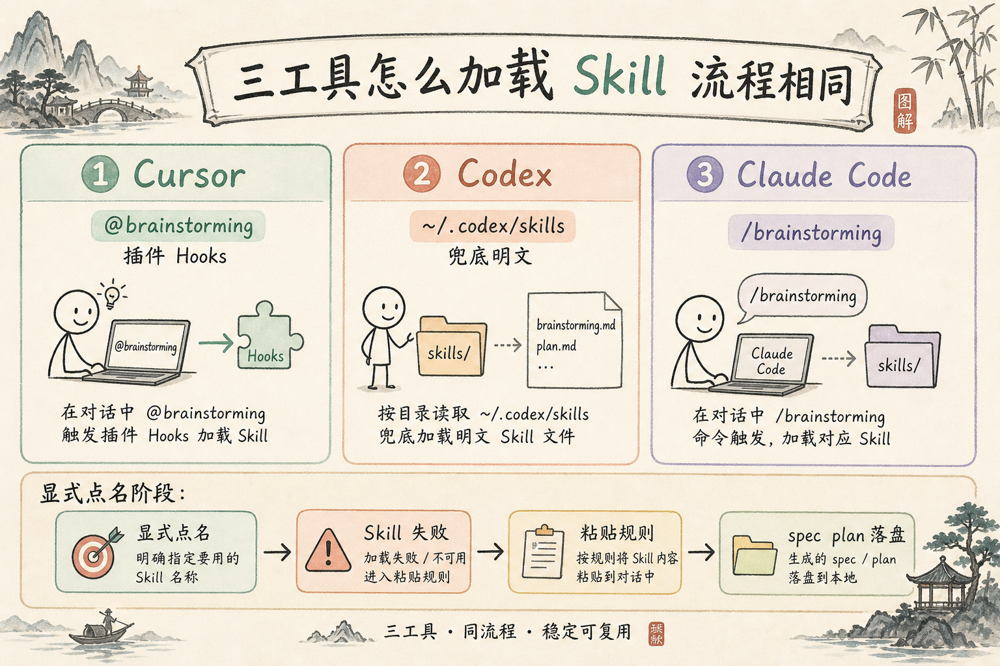
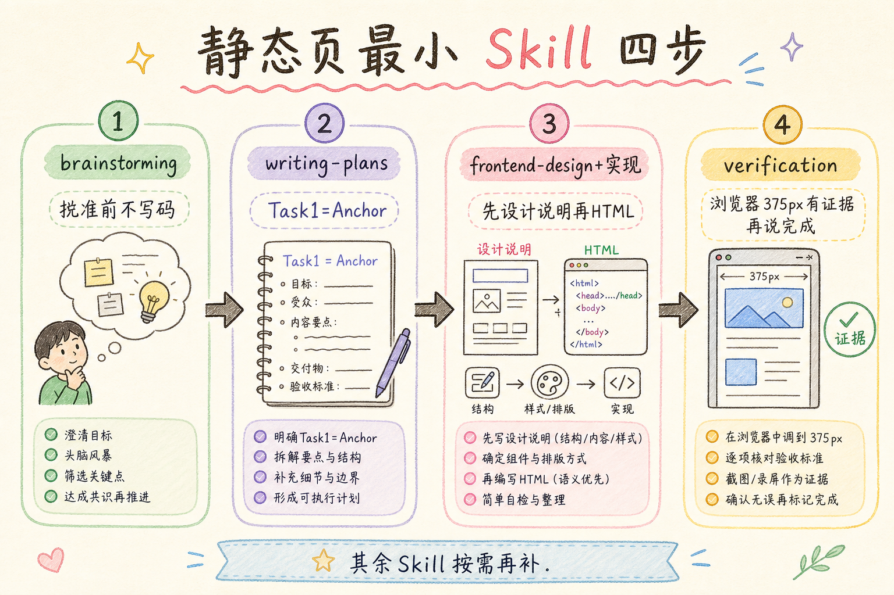
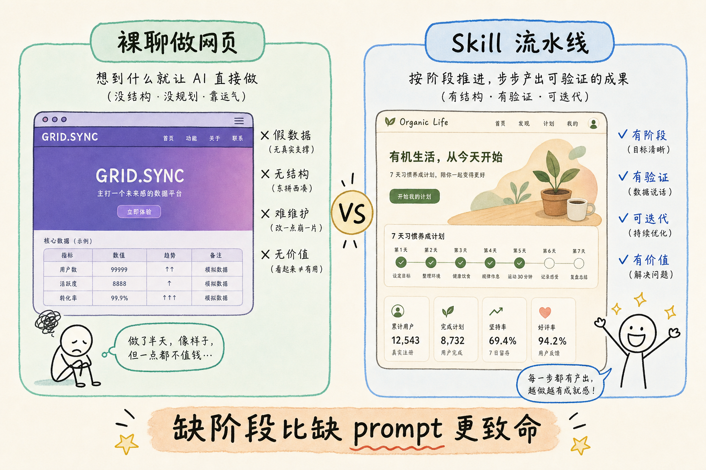
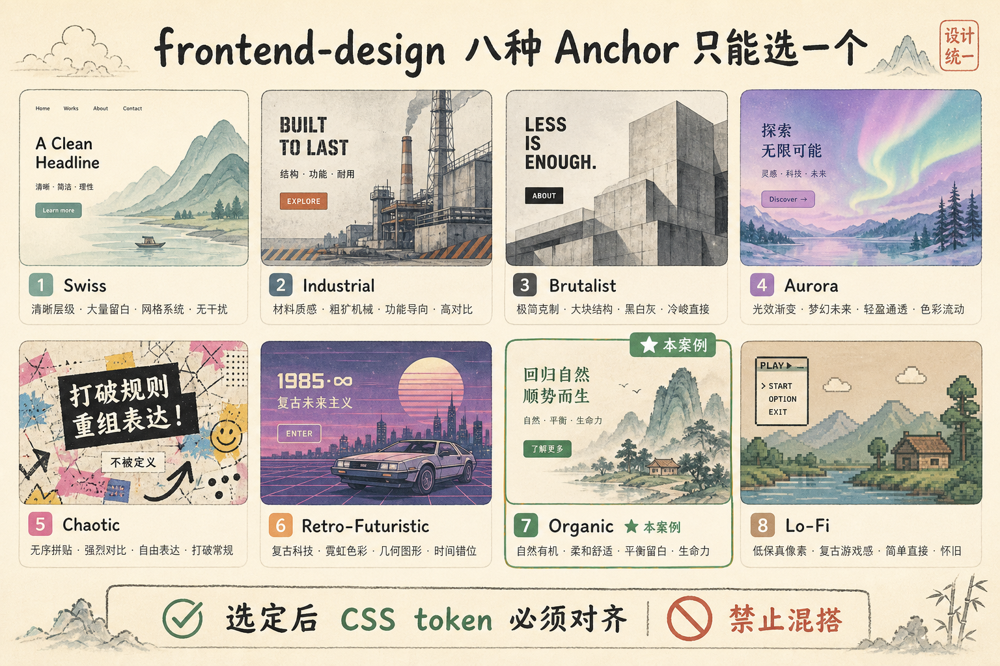
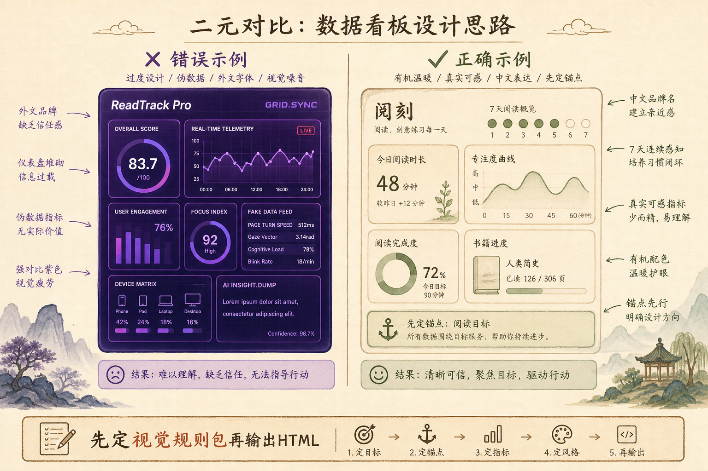
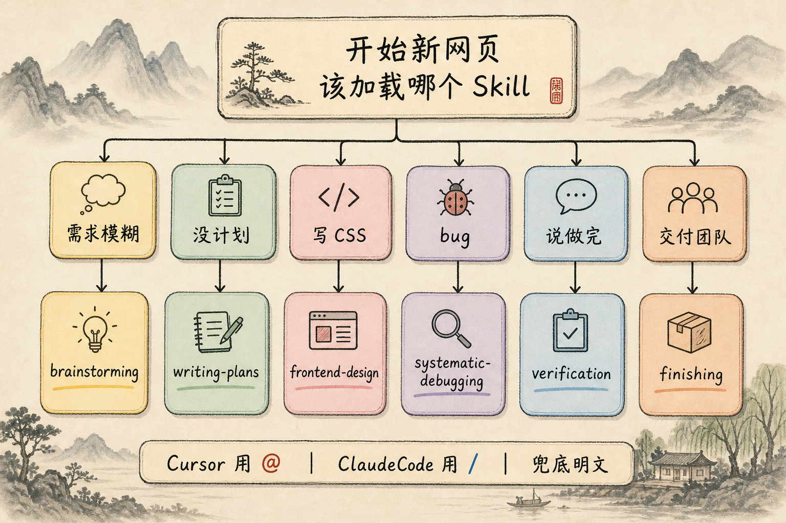

# 用 Superpowers + frontend-design 做网页：从零到验收的 Skill 协作指南

> 你想做一个「能看、能用、不像 AI 随便糊出来」的网页，但不知道在 **Cursor、Codex 还是 Claude Code** 里该先问什么、后写什么、怎么验收？这篇教程把 **Superpowers**（开发流程技能库）和 **frontend-design**（前端视觉与内容规范）串成一条**与工具无关、可复制**的流水线，并说明三种常见 AI 编程环境各自怎么加载 Skill。  
> **本文「验收」**指：本地浏览器检查通过、产物可交付；**公开上线**（域名、HTTPS）见 §5.8 可选步骤。

**阅读建议：** 本文是博客目录下的**工具链专题**（与 Python 系列教程并列），不依赖系列前几篇。假设你会基本的 **HTML/CSS**（能看懂标签和简单样式）；若完全零基础，建议先学任意一本 HTML 入门再回来。若你从未用过 Skill，先读完 §1 和 §2.4（工具对照）再动手。

**环境要求：**

> **配图说明**：文中插图位于 `../image/superpowers-frontend-design/`（`hand-drawn-edu` 风格，landscape 16:9，与 `.baoyu-skills/baoyu-infographic/EXTEND.md` 一致）；可复现 prompt 见同目录 `prompts/`。

| 类别 | 要求 |
|------|------|
| AI 工具（三选一或组合） | **Cursor**、**Codex** 或 **Claude Code** — 下文统称「Agent 工具」 |
| Superpowers | **Cursor**：安装 Superpowers 插件最省事；**Codex / Claude Code**：把对应 Skill 文件放到本机 skills 目录（见 §2.4） |
| frontend-design | 三工具通用；Skill 文件常见路径见 §2.4 |
| 本地预览 | 浏览器；推荐 **Python 3.x**（用于 `python -m http.server`，见 §5.3） |
| 网络 | §5.3 案例通过 Google Fonts 加载字体，**首次打开需联网**；离线见 §5.3 说明 |
| 编程基础 | 会保存 HTML、用浏览器打开、描述「哪里不对」即可跟完案例 |

> **术语**：**Agent**（智能体）：会读文件、写代码、跑命令的 AI 助手；Cursor Chat、Codex CLI、Claude Code 都属于这一类，下文不再区分模型名称。

---

## 目录

1. [前言：为什么需要「流程 Skill」而不只是「写代码」](#1-前言为什么需要流程-skill而不只是写代码)
2. [两个 Skill 分别管什么](#2-两个-skill-分别管什么)
   - [2.1 Superpowers 是什么](#21-superpowers-是什么)
   - [2.2 frontend-design 是什么](#22-frontend-design-是什么)
   - [2.3 二者如何配合](#23-二者如何配合)
   - [2.4 工具对照：Cursor / Codex / Claude Code](#24-工具对照cursor--codex--claude-code)
3. [Superpowers 开发流水线总览](#3-superpowers-开发流水线总览)
   - [3.1 阶段地图与最小 Skill 集合](#31-阶段地图与最小-skill-集合)
4. [frontend-design：写代码前的视觉决策](#4-frontend-design写代码前的视觉决策)
5. [完整案例：阅读打卡落地页](#5-完整案例阅读打卡落地页)
   - [5.8 可选：静态页公开部署](#58-可选静态页公开部署)
6. [每个 Superpowers Skill 的用法速查](#6-每个-superpowers-skill-的用法速查)
7. [常见陷阱与 FAQ](#7-常见陷阱与-faq)
8. [总结：核心概念速记与决策树](#8-总结核心概念速记与决策树)

---

## 1. 前言：为什么需要「流程 Skill」而不只是「写代码」

### 1.1 痛点场景

你可能遇到过这些局面：

- 对 Agent 说「帮我做一个登录页」，得到的是千篇一律的紫色渐变 + `Lorem ipsum` + 假邮箱 `user@example.com`。
- 第一版能跑，改三次后 CSS 和文案风格完全不一致。
- Agent 说「已完成、测试通过」，你打开浏览器却发现按钮点不了、移动端布局挤成一团。

根因往往不是「模型不会写 HTML」，而是**缺少可重复的阶段划分**：什么时候该定需求、什么时候该定视觉方向、什么时候该写计划、什么时候必须用命令验证。

### 1.2 读完你能做什么

学完本文，你应该能够（各 Skill 详解见 §3.1、§6）：

1. 用 **brainstorming**（头脑风暴阶段 Skill）把模糊想法变成**可批准的设计**——通俗说：先聊清「做什么、不做什么」，Agent **不许**一上来就写代码。
2. 用 **writing-plans**（写计划阶段 Skill）把设计拆成带 checkbox 的**任务清单**（plan）。
3. 用 **frontend-design** 在写 CSS 前选定 **Anchor**（视觉锚点），避免紫渐变模板页。
4. 用 **verification-before-completion**（完成前验证 Skill）在声称「做完」之前**自己打开浏览器检查**，而不是信 Agent 口头结论。
5. 在 Cursor / Codex / Claude Code 任一环境中走通单页静态站 **构思 → 本地验收** 全流程；需要公开访问时知道 §5.8 可选部署路径。

**静态页最小 Skill 四步**（其余 §6 中的 Skill 可后补）：brainstorming → writing-plans → frontend-design（与实现交织）→ verification-before-completion。

### 1.3 什么时候不必用这套流程

| 场景 | 建议 |
|------|------|
| 改一行 CSS 颜色 | 直接改，不必 brainstorm |
| 纯文案校对 | 不用 frontend-design |
| 已有成熟设计稿（Figma） | frontend-design 可简化为「严格还原稿面 **设计 token**（颜色、字号等变量）」 |
| 大型全栈项目（支付、权限、多服务） | 必须拆子项目，单篇案例不够，但流水线阶段相同 |

---

## 2. 两个 Skill 分别管什么

### 2.1 Superpowers 是什么

**Skill**（技能文件）：写给 Agent 看的 Markdown 工序说明，约定「这一阶段能做什么、不能做什么」。  
通俗说：像给实习生的**岗位 SOP**，@ 或粘贴进对话后 Agent 应按里面行事。

**Superpowers**（超能力流程包）：一组 Skill，把「头脑风暴 → 写计划 → 实现 → 调试 → 验证 → 收尾」串成标准阶段。Agent 读到 Skill 后会**按阶段约束自己的行为**，例如：brainstorming 阶段**禁止直接写代码**。

通俗说：Superpowers 像装修公司的**工序手册**——先量房、再出图、再施工、再验收，不能跳过。

> **和工具的关系**：Superpowers 在 **Cursor** 里以**插件**形式安装最完整。  
> **Hook**（钩子）：在特定时机（如新会话开始）自动执行的规则；Cursor 插件里的 sessionStart 即属此类。  
> **Subagent**（子 Agent）：主 Agent 派生的子任务执行者，适合并行拆 task；Cursor 插件支持，其他工具视版本而定。  
> 在 **Codex**、**Claude Code** 里通常是把同名 Skill 文件放到本机 skills 目录，或在对话里**粘贴 Skill 要点 / 点名 skill 名称**。**流程本身三工具通用**，差别主要在「怎么把 Skill 塞进上下文」。

### 2.2 frontend-design 是什么

**frontend-design**：独立 Skill，专注**网页长什么样、字写什么**。它不要求你用 React；静态 HTML 同样适用。

核心约束有三条：

1. **先选 Anchor（视觉锚点）**——八种固定美学方向之一（如 Swiss、Organic、Industrial），选定后 **CSS token**（设计 token：颜色、字体、圆角等写进 CSS 的变量）必须对齐，不能混搭。
2. **内容有纪律**——屏幕上的每个字要么是真实信息，要么是明确的示例数据；禁止假 **telemetry**（遥测读数：页面上像监控面板一样的假数字/假状态，如 `SYNC 99.97%`）、无意义的 mono 大写副标题。
3. **交付前要自检**——差异化设计点必须在页面上**看得见**，不能只在注释里写。

通俗说：frontend-design 是**美术总监 + 文案审核**，Superpowers 是**项目经理 + 质检**。

### 2.3 二者如何配合

```
Superpowers                          frontend-design
────────────                         ───────────────
brainstorming  →  定功能、用户、范围
writing-plans  →  拆 HTML/CSS 任务
      ↓
实现阶段  →  frontend-design  →  定 Anchor + 差异化 + 内容规范
      ↓
verification   →  浏览器打开、检查断点
finishing      →  合并/归档/写 README
```



**关键顺序**：frontend-design 在「动手写大量 CSS」之前介入；Superpowers 的 brainstorming **必须早于**任何实现 Skill（包括 frontend-design 里的 Implementation 步骤）。

### 2.4 工具对照：Cursor / Codex / Claude Code

三种工具都能跑本文案例；**Skill 文件名和阶段顺序不变**，变的是你怎么让 Agent「读到」它们。

| 维度 | Cursor | Codex | Claude Code |
|------|--------|-------|-------------|
| 典型形态 | IDE 内 Chat / Agent | CLI 或 IDE 扩展 | 终端 TUI / VS Code 扩展 |
| Superpowers 安装 | 插件市场装 **Superpowers** | 将 skill 放到 `~/.codex/skills/`（Windows：`%USERPROFILE%\.codex\skills\`） | 将 skill 放到 `~/.claude/skills/` 或项目内 |
| frontend-design 常见路径 | 可 @ 引用；亦可能在 `~/.codex/skills/frontend-design/` | `~/.codex/skills/frontend-design/SKILL.md` | `~/.claude/skills/` 或自行安装 |
| 加载 Skill 的主要方式 | 对话里 **`@skill-name`** 或 `@文件` | 提示词里 **`@skill-name`** / `$skill-name`（视版本而定） | **`/skill-name`**、`@skill-name`，或「按 xxx skill 执行」 |
| 项目级规则 | `.cursor/rules` | 项目说明 / AGENTS.md | **`CLAUDE.md`**、`.claude/` 配置 |
| 自动提醒（Hooks） | Superpowers **sessionStart** 等 | 依安装方式而定 | 依 Claude Code 版本与 hooks 配置 |
| 写文件 / 跑命令 | Agent 模式直接改仓库 | CLI 在工作目录执行 | 内置 bash、可编辑文件 |
| 本文推荐初学者 | 已用 Cursor 写前端 | 已习惯终端里跑 Agent | 已用 Claude Code 做仓库级任务 |



**统一原则（三工具都适用）**：

1. **显式点名阶段** — 不要只发「做个网页」；要写「现在处于 brainstorming 阶段，先不要写代码」。
2. **Skill 进不了上下文就降级** — 在消息开头写：`请严格按 brainstorming skill：先问问题、用户批准前禁止写代码。`
3. **产物落盘路径自己定** — Superpowers 默认 `docs/superpowers/specs/`、`docs/superpowers/plans/`；**spec**（设计规格：功能、用户、边界的文字说明）与 **plan**（实现计划：带 checkbox 的任务清单）文件名可自定，Codex / Claude Code 无插件时也可放在 `docs/` 或 `temp/`，**关键是「有 spec、有 plan、有 checkbox」**。

#### 装好后如何确认 Skill 已生效（Codex / Claude Code 尤其需要）

发送一句**探针 prompt**，看 Agent 是否遵守 HARD-GATE（硬门槛：未到阶段禁止下一阶段，见 §6.1）：

```
@brainstorming
我想做一个首页。请先确认你当前是否加载了 brainstorming skill：
若已加载，只问一个问题，不要写代码。
```

若 Agent 仍直接输出 HTML，改用 §2.4 **兜底明文**，或 `@` / 打开对应 `SKILL.md` 文件路径。

#### 各工具加载 Skill 示例

**Cursor**

```
@brainstorming
我想做一个阅读打卡落地页……先不要写代码。
```

**Codex**（Skill 已在 `~/.codex/skills/` 时）

```
@brainstorming
（或）请使用 brainstorming skill。我想做一个阅读打卡落地页……先不要写代码。
```

**Claude Code**

```
/brainstorming
（或）按照 superpowers 的 brainstorming skill 执行：……先不要写代码。
```

若 `@` / `/` 找不到 skill，**兜底写法**（三工具通用）：

```
请阅读并按照以下规则执行（brainstorming 阶段）：
- 先问我澄清问题，一次一个
- 提出 2～3 种方案并等我批准
- 在我明确说「设计已批准」之前，不要创建或修改任何代码文件
```

---

## 3. Superpowers 开发流水线总览

### 3.1 阶段地图与最小 Skill 集合

> **顺序要点**：**frontend-design 不是「全部代码写完再美化」**。正确顺序是：brainstorming → writing-plans → **按计划实现时，第一个实现 task 必须是 Anchor + Stated direction，然后才写 HTML/CSS**（与 executing-plans 交织进行）。

| 阶段 | Skill | 输入 | 输出 | 初学者要记住的一句话 |
|------|-------|------|------|---------------------|
| 0 | using-superpowers | 新会话 | 知道该加载哪个 Skill | 大任务别裸聊，先加载 Skill |
| 1 | brainstorming | 模糊需求 | spec + 用户批准 | **没批准设计就不写代码** |
| 2 | writing-plans | 已批准 spec | plan.md 任务清单 | 一步只做一件事 |
| 3 | executing-plans + **frontend-design（交织）** | plan 文件 | Task1：Anchor + 设计说明；Task2+：HTML/CSS | **先定视觉再写 CSS** |
| 4 | test-driven-development | 有 JS 等行为 | 先红后绿（**可选**） | 静态页可跳过 |
| 5 | systematic-debugging | bug / 布局坏了 | 根因 + 修复 | 先复现再改 |
| 6 | verification-before-completion | 声称完成前 | 命令/截图证据 | **没打开浏览器别说做完** |
| 7 | requesting-code-review / code-reviewer | 大改动完成 | 审查意见（**可选**） | 第二双眼睛 |
| 8 | finishing-a-development-branch | 测试通过 | PR / 合并 / 清理（**可选**） | 收尾选项清单 |

**静态页最小 Skill 集合（日常够用）**：上表阶段 **1 → 2 → 3 → 6** 即可；阶段 4、7、8 在加 JavaScript 或团队协作时再补。

**writing-plans 里应显式写出**（避免 Agent 跳步）：

```markdown
### Task 1: frontend-design — Anchor + Stated direction（不写 HTML）
### Task 2: index.html 骨架 + Organic token
### Task 3: Hero + 差异化圆点 …
```



### 3.2 ASCII 时间线（单页网站典型一周业余节奏）

```
Day1  brainstorming     ████░░░░░░  定「阅读打卡落地页」范围
Day1  用户批准 spec      ██░░░░░░░░  确认：单页、无后端、移动端优先
Day2  writing-plans     ███░░░░░░░  拆 8～12 个小 task（Task1 = Anchor）
Day2  frontend-design   ████░░░░░░  选 Organic + 差异化：7 日圆点打卡条
Day3  实现 HTML/CSS     ███████░░░  按 plan 从 Task2 起勾选
Day3  verification      ██░░░░░░░░  375px / 768px / 1280px 各截图
Day4  web-qa-fix（可选）██░░░░░░░░  走查清单修边角
Day4  公开部署（可选）  ██░░░░░░░░  见 §5.8
```

### 3.3 在各工具里怎么唤起 Skill

下文用 **`@skill-name`** 表示「把该 Skill 载入上下文」——在 Cursor 里最常用；Codex / Claude Code 若 `@` 无效，改用 §2.4 的 `/skill-name` 或**兜底明文规则**。

**推荐写法**（多数 Skill 需**手动加载**，不会自动触发）：

```
@brainstorming
我想做一个阅读打卡落地页，目标用户是大学生，先不要写代码。
```

```
@writing-plans
设计已批准，请根据上面的 spec 写实现计划，保存到 docs/superpowers/plans/
```

```
@frontend-design
按 Organic anchor 实现 hero（首屏）+ 表单区，内容用真实文案，不要假数据。
```

**按工具微调：**

| 阶段 | Cursor | Codex | Claude Code |
|------|--------|-------|-------------|
| 头脑风暴 | `@brainstorming` | `@brainstorming` 或点名 skill 文件 | `/brainstorming` 或「按 brainstorming skill」 |
| 写计划 | `@writing-plans` | 同上 | `/writing-plans` |
| 做页面 | `@frontend-design` | `@frontend-design`（路径常在 `~/.codex/skills/`） | 同上或粘贴 Anchor 约束摘要 |
| 验收 | `@verification-before-completion` | 同上；Codex 可让 Agent 自己跑 `python -m http.server` | 同上；强调「先跑命令再给结论」 |

Cursor 旧命令 `/brainstorm`、`/write-plan` 已弃用，统一用 **Skill 名称**。Claude Code 的 `/` 命令以你本机安装的 skills 为准，名称可能与 Cursor 插件略有不同，**以 SKILL.md 里的 `name:` 字段为准**。

### 3.4 Hooks 与自动提醒（主要限于 Cursor；其他工具视配置而定）

**Hook**（钩子）：在特定时机自动执行的脚本或规则。

- **Cursor + Superpowers 插件**：**sessionStart** 等 Hook 会在新会话开始时运行，Agent 更容易提醒「要不要先 brainstorm」。
- **Codex / Claude Code**：若无同等 Hook，**不要依赖自动提醒**——在每条任务消息里重复当前阶段（如「仍在 brainstorming，禁止写码」）更可靠。

对初学者的实际意义：**最稳的方式**仍是在第一条消息里显式加载 Skill 或粘贴阶段规则；Hook 只是加分项，不是必需品。

### 3.5 与「直接聊天写代码」的对比

| 方式 | 第一版速度 | 第三版质量 | 适合 |
|------|------------|------------|------|
| 裸聊「做个网页」 | 快 | 常崩（风格乱、假数据） | 一次性草稿 |
| 仅 Superpowers（不管视觉 Skill） | 较慢 | 结构稳，视觉可能仍偏通用模板 | 功能型页面 |
| Superpowers + frontend-design | 最慢 | 结构 + 视觉 + 文案都受约束 | 要拿得出手的页面 |

直觉类比：裸聊像让施工队没图纸就砌墙；加 frontend-design 像同时请了结构工程师和室内设计师。**决策以本节表格为准**——若你只想要 **wireframe**（线框图：只关心块区布局、不上最终视觉），可省略 frontend-design 的 token 严格性，但仍建议保留 brainstorming 定范围。



---

## 4. frontend-design：写代码前的视觉决策

### 4.1 五步工作法（Skill 原文浓缩）

frontend-design 要求写代码前按顺序完成：

1. **Context（上下文）**——一句话说清页面解决什么问题、给谁看。
2. **Anchor（锚点）**——八种美学之一，**只选一个**，禁止「Swiss + Brutalist 混搭」。
3. **Differentiator（差异化）**——一个让人记住的细节（例如：日期卡片带轻微旋转的 Lo-Fi 贴纸感）。
4. **System（系统）**——严格使用该 Anchor 的 CSS token。
5. **Implementation（实现）**——再写 HTML/CSS；文案遵守「内容纪律」。

### 4.2 八种 Anchor 初学者怎么选

| Anchor | 一句话印象 | 适合本案例吗 |
|--------|------------|--------------|
| Swiss | 白底、红线、网格、极简 | 适合「工具感、严肃阅读」 |
| Industrial | 黑底、等宽字、终端风 | 适合「开发者向」 |
| Brutalist | 纯色块、硬阴影、原生控件 | 适合「艺术/实验」 |
| Aurora Maximalism | 暗色霓虹渐变 | 适合「活动营销页」 |
| Chaotic Maximalism | 高饱和碰撞 | 慎用，易失控 |
| Retro-Futuristic | 赛博/CRT 扫描线 | 适合「游戏/科幻」 |
| **Organic** | 大地色系（earth tone）、圆角、纸纹颗粒（grain） | **本案例选用：温暖、读书氛围** |
| Lo-Fi | 纸黄、旋转、半色调 | 适合「手账/独立杂志」 |



#### 4.2.1 各 Anchor 一条「禁忌」（Breaks if）

| Anchor | 出现下面元素说明 Anchor 没 hold 住 |
|--------|-------------------------------------|
| Swiss | 暖色纸纹、衬线标题、居中排版 |
| Industrial | 圆角、衬线、装饰阴影 |
| Organic | 纯黑 #000 大底、冷灰、**奶油白 `#F0` 段暖纸色** |
| Lo-Fi | 所有元素严格方格对齐、单一字体 |

本教程案例选 **Organic**：读者打卡场景需要**平静、专注**的氛围，而不是「赛博朋克登录面板」那种炫技视觉。

> **术语**：**Anchor**（锚点）：frontend-design 里预先定义好的整套视觉规则包，不是 HTML 的 `<a>` 标签。

### 4.3 内容纪律：什么字不能出现在页面上

**禁止示例（frontend-design §2）：**

- 假用户 `a.chen@grid.co`
- 装饰性大写副标题 `SECURE OPERATOR AUTHENTICATION`（登录页却像军事系统）
- 把「登录」改成 `Authenticate Session`（无意义的「酷」）
- 用 Unicode 符号冒充图标 `▣ Dashboard`

**正确示例（本案例）：**

- 按钮写「开始打卡」，不写「Initiate Session」
- 统计区若暂无后端，写「示例：本周 3 天」并标注为演示，或留空
- 表单字段名用中文或通用英文 `Email`，不编造品牌遥测读数

### 4.4 先错后对：没有 Anchor 时会发生什么

**错误做法**——直接说「做一个好看的阅读页」：

```html
<!-- Agent 常见默认：Inter 字体 + 紫蓝渐变 + 假数据 -->
<section style="background: linear-gradient(135deg, #667eea, #764ba2)">
  <h1>Welcome to ReadTrack Pro</h1>
  <p>Join 10,000+ operators worldwide</p>
  <p>GRID.SYNC 99.97%</p>
</section>
```

**问题**：渐变和「operator」文案与阅读打卡无关；`GRID.SYNC` 是典型 **伪造遥测读数**（fabrication posing as real data：编造看起来像真实监控的数据）。



**正确做法**——先加载 frontend-design（或粘贴其 Anchor 约束）并声明方向：

```markdown
Context: 大学生自用阅读打卡落地页，单页，无后端。
Anchor: Organic — sage/clay 色、Fraunces 标题、16px 圆角、1% grain。
Differentiator: 本周打卡用 7 个小圆点排成一行，已打卡为 terracotta 实心。
内容: 真实中文文案，统计区仅展示静态示例并注明。
```

然后再让 Agent 输出 HTML。下面 §5 给出完整可运行结果。

---

## 5. 完整案例：阅读打卡落地页

> **阅读顺序**：请先读完 §2～§4。本节假设你已经完成 brainstorming（功能：**Hero**（首屏主视觉区）、本周打卡、添加记录表单、页脚说明）并批准 spec。

> **术语**：**Hero**（首屏）：打开页面第一眼看到的主标题 + 一句话说明 + 主按钮区域。**CTA**（Call To Action，行动号召）：希望用户点的主按钮，如「开始打卡」。**375px**：Chrome 开发者工具里模拟窄屏（约 iPhone SE 宽度）的常用宽度，用来检查手机布局。

### 5.1 案例需求摘要（brainstorming 产出物示例）

| 项 | 决定 |
|----|------|
| 产品名 | 「阅刻」—— 个人阅读打卡（虚构但一致的品牌名，非假公司） |
| 用户 | 大学生，手机为主 |
| 范围 | 单 HTML 文件 + 内联 CSS，无 JS 框架 |
| 不做 | 登录、数据库、图表库 |
| 成功标准 | 375px 下可读完；表单可聚焦；无假遥测读数 |

### 5.2 writing-plans 任务清单（节选）

实现计划应类似（每步 2～5 分钟粒度）：

```markdown
# 阅刻落地页 Implementation Plan

**Goal:** 交付单文件 Organic 风格阅读打卡落地页。

**Architecture:** 语义化 HTML5 + 内联 CSS；Mobile-first（移动端优先：先写窄屏样式，再用 `@media` 加宽屏）；无 JS。

---

### Task 1: frontend-design — Anchor + Stated direction（本步不写 HTML）
- [ ] 选定 Organic；写 Stated direction 一段话
- [ ] 确认 Differentiator：7 日圆点

### Task 2: 文档骨架
- [ ] 创建 `index.html`，`<meta viewport>`，lang=zh-CN

### Task 3: Organic token 变量
- [ ] `:root` 定义 sage/clay/terracotta/sand/oat
- [ ] 引入 Fraunces + Epilogue 字体 link（需联网）

### Task 4: Hero
- [ ] h1 + 一句价值主张 + CTA 按钮「开始打卡」

### Task 5: 本周打卡 Differentiator
- [ ] 7 个圆点，3 个 filled 作静态示例，附注「示例数据」

### Task 6: 表单区
- [ ] 书名、页码、日期；标准 label；submit「保存记录」

### Task 7: 响应式
- [ ] `@media (min-width: 768px)` 两栏布局

### Task 8: verification
- [ ] 浏览器打开（见 §5.3 三种预览方式）
- [ ] 截图 375 / 768 / 1280
```

**演示什么**：计划如何把「设计」切成 Agent 不会一次写崩的小步。  
**环境**：Markdown 编辑器即可，文件建议放在 `yueke-landing/`。  
**预期**：按 checkbox 逐项勾选，避免一次生成 300 行无法 review 的代码。

### 5.3 实现：完整可运行 HTML

**演示什么**：Organic Anchor + 内容纪律 + 移动端优先的单页落地页。  
**前置**：保存为 `index.html`；**需联网**加载 Google Fonts（断网时标题/正文回退为 Georgia、system-ui，Organic 感会减弱）。表单带 `onsubmit="return false;"` 是**故意禁用提交**——纯静态演示不假装能保存到服务器，见页面底部 hint。  
**预期**：看到暖色背景、圆角卡片、7 日圆点示例、可聚焦表单；无紫色渐变、无假遥测读数。

```html
<!DOCTYPE html>
<html lang="zh-CN">
<head>
  <meta charset="UTF-8" />
  <meta name="viewport" content="width=device-width, initial-scale=1" />
  <title>阅刻 — 阅读打卡</title>
  <link rel="preconnect" href="https://fonts.googleapis.com" />
  <link href="https://fonts.googleapis.com/css2?family=Epilogue:wght@400;600&family=Fraunces:opsz,wght@9..144,600&display=swap" rel="stylesheet" />
  <style>
    :root {
      --sage: #8B9D83;
      --clay: #B08B6E;
      --terracotta: #C66B3D;
      --sand: #E8DCC7;
      --oat: #D4B895;
      --moss: #606C38;
      --text: #3d3429;
      --radius: 20px;
    }
    * { box-sizing: border-box; }
    body {
      margin: 0;
      font-family: "Epilogue", system-ui, sans-serif;
      color: var(--text);
      background: var(--sand);
      line-height: 1.6;
    }
    /* Organic: 1% grain via SVG noise */
    body::before {
      content: "";
      position: fixed;
      inset: 0;
      opacity: 0.03;
      pointer-events: none;
      background-image: url("data:image/svg+xml,%3Csvg viewBox='0 0 256 256' xmlns='http://www.w3.org/2000/svg'%3E%3Cfilter id='n'%3E%3CfeTurbulence type='fractalNoise' baseFrequency='0.9' numOctaves='4' stitchTiles='stitch'/%3E%3C/filter%3E%3Crect width='100%25' height='100%25' filter='url(%23n)'/%3E%3C/svg%3E");
    }
    .wrap { max-width: 960px; margin: 0 auto; padding: 1.25rem; }
    header { padding: 2rem 0 1rem; }
    h1 {
      font-family: "Fraunces", Georgia, serif;
      font-size: clamp(2rem, 5vw, 2.75rem);
      margin: 0 0 0.5rem;
      color: var(--moss);
    }
    .lead { font-size: 1.05rem; max-width: 32ch; }
    .btn {
      display: inline-block;
      margin-top: 1rem;
      padding: 0.75rem 1.25rem;
      background: var(--terracotta);
      color: #fff;
      border: none;
      border-radius: var(--radius);
      font-weight: 600;
      text-decoration: none;
      cursor: pointer;
      transition: transform 0.35s ease, box-shadow 0.35s ease;
    }
    .btn:hover { transform: translateY(-2px); box-shadow: 0 6px 20px rgba(198, 107, 61, 0.25); }
    .grid {
      display: grid;
      gap: 1.25rem;
      margin-top: 2rem;
    }
    @media (min-width: 768px) {
      .grid { grid-template-columns: 1fr 1fr; align-items: start; }
    }
    .card {
      background: var(--oat);
      border-radius: var(--radius);
      padding: 1.25rem 1.5rem;
      border: 1px solid rgba(96, 108, 56, 0.12);
    }
    .card h2 {
      font-family: "Fraunces", Georgia, serif;
      font-size: 1.25rem;
      margin: 0 0 1rem;
      color: var(--clay);
    }
    /* Differentiator: 7-day dots */
    .week-dots {
      display: flex;
      gap: 0.5rem;
      flex-wrap: wrap;
      margin-bottom: 0.75rem;
    }
    .dot {
      width: 2rem;
      height: 2rem;
      border-radius: 50%;
      border: 2px solid var(--sage);
      background: transparent;
    }
    .dot.filled { background: var(--terracotta); border-color: var(--terracotta); }
    .hint { font-size: 0.85rem; color: var(--clay); }
    label { display: block; margin-top: 0.75rem; font-weight: 600; }
    input {
      width: 100%;
      margin-top: 0.35rem;
      padding: 0.65rem 0.75rem;
      border: 1px solid var(--sage);
      border-radius: 12px;
      font: inherit;
      background: #fff;
    }
    footer {
      margin-top: 3rem;
      padding-top: 1rem;
      border-top: 1px solid rgba(96, 108, 56, 0.15);
      font-size: 0.9rem;
      color: var(--clay);
    }
  </style>
</head>
<body>
  <div class="wrap">
    <header>
      <h1>阅刻</h1>
      <p class="lead">每天读一点，用一张简单卡片记录今天读了什么。不需要社交，只对自己诚实。</p>
      <a class="btn" href="#log">开始打卡</a>
    </header>

    <div class="grid">
      <section class="card" aria-labelledby="week-title">
        <h2 id="week-title">本周打卡</h2>
        <div class="week-dots" aria-label="一周七天打卡示例">
          <span class="dot filled" title="周一"></span>
          <span class="dot filled" title="周二"></span>
          <span class="dot filled" title="周三"></span>
          <span class="dot" title="周四"></span>
          <span class="dot" title="周五"></span>
          <span class="dot" title="周六"></span>
          <span class="dot" title="周日"></span>
        </div>
        <p class="hint">以上为页面静态示例；接入后端前不会保存真实数据。</p>
      </section>

      <section class="card" id="log" aria-labelledby="form-title">
        <h2 id="form-title">添加记录</h2>
        <form action="#" method="post" onsubmit="return false;">
          <label for="title">书名</label>
          <input id="title" name="title" type="text" placeholder="例如：活着" required />

          <label for="pages">读到第几页</label>
          <input id="pages" name="pages" type="number" min="1" placeholder="42" />

          <label for="date">日期</label>
          <input id="date" name="date" type="date" required />

          <button class="btn" type="submit" style="margin-top:1rem;">保存记录</button>
        </form>
        <p class="hint">当前为纯前端演示，点击保存不会写入服务器。</p>
      </section>
    </div>

    <footer>
      <p>阅刻 · 个人阅读打卡页 · 由 AI Agent + Superpowers + frontend-design 工作流生成</p>
    </footer>
  </div>
</body>
</html>
```

**本地预览（verification 阶段选一种）**：

```bash
# 方式 A（推荐）：Python 3.x 内置 HTTP 服务
# 在 index.html 所在目录执行；Windows/macOS/Linux 均可用
python -m http.server 8080
# 浏览器访问 http://localhost:8080
```

```bash
# 若提示找不到 python，可试 python3 -m http.server 8080
```

```
方式 B：直接双击 index.html，地址栏为 file://…
  - 优点：无需 Python
  - 缺点：部分浏览器对 file:// 限制较多；与 http:// 表现可能略有差异
```

```
方式 C：VS Code / Cursor 的 Live Server 等扩展（若已安装）
```

**断网字体说明**：若需完全离线且保持 Fraunces/Epilogue，须自行下载字体文件并改 `@font-face`；初学者验收时可接受系统回退字体，但应在 verification 清单里注明。

### 5.4 案例中的 Skill 对话脚本（三工具可复制改）

以下以 **Cursor 的 `@` 写法** 为模板；Codex / Claude Code 把 `@skill` 换成 §2.4 对应方式即可，**阶段顺序不变**。

**Step 1 — brainstorming**

```
@brainstorming
我要做一个叫「阅刻」的阅读打卡落地页，用户是大学生，手机优先。
功能：Hero、本周打卡展示、添加记录表单。不要后端。
请先问我问题，不要写代码。
```

**Claude Code 等价**：`/brainstorming` 开头，或「按 brainstorming skill，先问问题不要写码」。

**Codex 等价**：`@brainstorming`；若无 skill 索引，把 §2.4 兜底 brainstorming 规则粘贴到消息顶部。

Agent 应一次只问一个问题，最后给出 2～3 种方案（例如单页 vs 多页）并等你批准。

**Step 2 — writing-plans**

```
@writing-plans
设计已批准：单页 Organic 风。请写 implementation plan；
Task 1 必须是 frontend-design（Anchor + Stated direction，不写 HTML）；
其余 task 粒度 2～5 分钟一步。
```

**Step 3 — frontend-design + 实现**

```
@frontend-design
Context: 阅刻阅读打卡落地页。
Anchor: Organic。sage/clay/terracotta，Fraunces + Epilogue，grain 纹理。
Differentiator: 7 日圆点打卡条。
请先写一段设计方向说明（Stated direction），再输出 index.html。
内容纪律：中文真实文案，示例数据须标注，禁止假遥测读数。
```

**Step 4 — verification-before-completion**

```
@verification-before-completion
请启动 python -m http.server，列出我应在 375px 宽度下检查的 5 项清单，不要声称「已完成」直到我确认。
```

> **Codex / Claude Code 提示**：这两类工具往往**能直接在终端起服务、读输出**。应要求 Agent「在本机跑 server 并汇报端口」，而不是只给命令让你自己猜有没有执行。Cursor Agent 模式同理——**谁跑命令不重要，重要的是有 fresh 证据**（见 §6.6）。

### 5.5 验收清单（verification 证据）

| 检查项 | 通过标准 |
|--------|----------|
| Anchor 一致性 | 无纯黑 #000 大底、无 Inter 默认栈、圆角 ≥16px |
| 内容纪律 | 无 `operator`、无 `GRID.xxx`、按钮是「保存记录」 |
| 差异化可见 | 7 个圆点在一屏内可见 |
| 移动端 | 375px 无横向滚动；表单可点击 |
| 诚实标注 | 示例数据有 hint 说明 |
| 字体 / 网络 | 联网时 Fraunces/Epilogue 加载正常；断网若可接受回退须在 plan 中注明 |

### 5.6 案例复盘：同一句 prompt 的两种结局

下面用**同一句用户输入**，对比「没用 Skill」和「用完整流水线」的差异。这是初学者最该记住的对照实验。

**用户输入：**

> 帮我做一个阅读打卡网页，要好看一点。

**结局 A — 未 @ 任何 Skill（常见失败模式）**

Agent 可能直接输出 200 行 HTML：Inter 字体、蓝紫渐变、统计卡片写「10,000+ readers synced」，表单按钮叫 `Submit Entry`。你改配色时，渐变和卡片阴影互相打架；第三遍要求「更简洁」后，Hero 变白了但表单区仍是深色，整页像两个网站拼在一起。

**危害**：初学者会以为「AI 做网页就这样」，不知道问题出在**缺阶段**而不是缺 prompt 技巧。

**结局 B — 按本文流水线**（Cursor / Codex / Claude Code 相同）

1. 加载 **brainstorming**（`@`、`/` 或兜底规则）先锁定：单页、无后端、中文、示例数据须标注。  
2. 你批准「Organic + 7 日圆点」后，**writing-plans** 拆 7 个 task。  
3. **frontend-design** 先输出 **Stated direction**（设计方向说明）一段设计师口吻文字，再出 §5.3 的 HTML。  
4. **verification-before-completion** 要求 Agent 给出 375px 检查项；你在浏览器本地打开确认（Agent 可代跑 server，但不能代替你看一眼布局）。

**结果**：第一版可能仍不完美，但**失败是可定位的**——例如「圆点 contrast 不够」只改 `.dot.filled`，不会动整页渐变背景。

> **术语**：**Stated direction**（设计方向说明）：frontend-design 要求在代码前先写一段话，说明选了哪个 Anchor、为什么、差异化是什么。不是给用户看的营销文案（marketing copy），而是给实现者（包括未来的你）的设计备忘录。

### 5.7 若要给案例加 JavaScript（进阶，可跳过）

**要不要读**：只想学静态页流程可跳过；若你要「点击保存真的变圆点」，读完 §5.3 后再回来。

**阅读顺序**：§6.4 TDD → 本节（§6 阶段编号已更新，TDD 仍为 test-driven-development 小节）。

在静态 HTML 上增加 **localStorage**（浏览器本地键值存储：数据保存在用户电脑，不上传服务器）时，建议顺序：

1. **writing-plans** 追加 Task：「localStorage 读写 + 圆点同步」  
2. **test-driven-development**：先写测试「存 `{date, title}` 后 read 回来」  
3. 实现最小 JS，仍保持 Organic token 不动  
4. **verification-before-completion**：手动点保存 + 刷新页面，圆点状态仍在

**同步/前文对照**：

| 已有（静态） | 加 JS 后 |
|--------------|----------|
| 圆点 `.filled` 写死在 HTML | JS 根据 `localStorage` 切换 class |
| 表单 `onsubmit="return false"` | 改为 `preventDefault` + 写入 + 更新 DOM |
| hint「不会写入服务器」 | 改为「记录保存在本机浏览器」——**诚实**，不假装有云端 |

### 5.8 可选：静态页公开部署

**要不要读**：本地验收（§5.5）通过即可结束；只有需要**公网 URL** 时再读。

**阅读顺序**：§5.5 验收通过 → 本节。

本文案例不含后端，可选把 `index.html`（及同目录静态资源）部署到免费静态托管。最小路径（GitHub Pages 示例）：

1. 建 GitHub 仓库，上传 `index.html` 到根目录或 `docs/` 文件夹。  
2. 仓库 **Settings → Pages** → Source 选分支与目录 → Save。  
3. 等待 1～3 分钟，访问 `https://<用户名>.github.io/<仓库名>/` 验证。

Netlify「拖拽文件夹上传」同理：把含 `index.html` 的文件夹拖进控制台即可。**部署后仍建议**用 verification 清单在真机 375px 宽度下再看一遍。

---

## 6. 每个 Superpowers Skill 的用法速查

> **阅读建议**：不必背 9 个 Skill。静态页默认 **§3.1 最小四步**；下表供查阅。案例是否用到见「本文案例」列。

| 阶段 | Skill | 白话 | 本文案例 |
|------|-------|------|----------|
| 1 | brainstorming | 先聊需求，批准前不写码 | ✅ |
| 2 | writing-plans | 拆 checkbox 任务 | ✅ |
| 3 | executing-plans + frontend-design | 先 Anchor 再 HTML/CSS | ✅ |
| 4 | test-driven-development | 先写失败测试（有 JS 时） | ⏭ §5.7 |
| 5 | systematic-debugging | 先复现再改 bug | 按需 |
| 6 | verification-before-completion | 有证据再说完成 | ✅ |
| 7 | requesting-code-review | 合并前审查 | 可选 |
| 8 | finishing-a-development-branch | PR / 合并 / 清理 | 可选 |
| — | web-qa-fix | 结构化 QA 走查 | 可选 |

### 6.1 brainstorming

**何时用**：任何新页面、新组件、改行为之前。  
**硬门槛**：**HARD-GATE**（硬门槛）：Skill 内写的「此阶段禁止事项」；brainstorming 的 HARD-GATE 是**用户批准 spec 前不得写代码**。  
**你怎么配合**：认真回答 Agent 的澄清问题；对「单页 vs 多页」这类分叉给出明确选择。

**典型输出**：设计段落 + 可选 `docs/superpowers/specs/YYYY-MM-DD-xxx-design.md`

### 6.2 writing-plans

**何时用**：设计已批准，准备动手。  
**输出**：带 checkbox 的计划，每步极小。  
**提示词模板**：

```
@writing-plans
基于已批准的 spec，写 plan。假设执行者不了解本仓库。Tech stack: HTML/CSS only。
```

### 6.3 executing-plans / subagent-driven-development

**何时用**：计划已在磁盘上，要逐 task 执行。  
**区别（初学者可记）**：

- **executing-plans**：适合另开会话、**检查点 review（中途审阅）**
- **subagent-driven-development**：当前会话里并行子任务

```
@executing-plans
请按 docs/superpowers/plans/2026-06-29-yueke-landing.md 执行 Task 1～3，做完暂停等我 review。
```

### 6.4 test-driven-development

**何时用**：有 JavaScript 逻辑（例如本地存储打卡）时。  
**静态 HTML 案例**：可跳过自动化测试，但加 JS 后应对「存一条记录 → 圆点变 filled」写失败测试再实现。

```
@test-driven-development
为「保存记录写入 localStorage 并更新圆点」写 failing test，再用最小 JS 通过。
```

### 6.5 systematic-debugging

**何时用**：布局错位、按钮无效、Skill 没按 Anchor 出图。  
**流程**：复现 → 假设 → 实验 → 修复，**禁止**未定位就改十处 CSS。

```
@systematic-debugging
768px 下两栏重叠，请先复现并给出最可能的一条 CSS 原因。
```

### 6.6 verification-before-completion

**何时用**：每次要说「做完了」「没问题了」之前。  
**铁律**：**NO COMPLETION CLAIMS WITHOUT FRESH VERIFICATION EVIDENCE**（没有**新的**验证证据，不得声称完成）。

你应该要求 Agent 给出：

1. 跑过的命令（如 `python -m http.server`；**curl** 为命令行请求 URL 的工具，可选；**Playwright** 为浏览器自动化测试工具，可选）
2. 退出码 / 截图描述
3. 未通过则如实报失败

### 6.7 requesting-code-review / code-reviewer

**何时用**：页面将分享或合并进团队仓库。  
**提示词**：

```
@requesting-code-review
请对照 Organic anchor 与内容纪律审查 index.html，列出严重/中等/轻微问题。
```

### 6.8 finishing-a-development-branch

**何时用**：验收通过，决定如何交付。  
**输出选项**：开 PR、打 tag、写 README、删实验分支等——Agent 应给结构化选项而非默认 git push。

### 6.9 可选：web-qa-fix / web-qa-report

**web-qa-fix**：结构化网页 QA Skill，检查键盘可达性、对比度、断点等。若已安装，可在 verification 之后使用。初学者至少手动测 375px。

---

## 7. 常见陷阱与 FAQ

### 7.1 常见陷阱（反例优先）

| 陷阱 | 表现 | 正确做法 |
|------|------|----------|
| 跳过 brainstorming | 第一句就 `index.html` 满屏 | 先加载 brainstorming 并等批准 |
| 混搭 Anchor | Swiss 网格 + Organic 圆角 + 霓虹 glow | 重新选 ONE Anchor |
| 假数据装真 | `ACTIVE_USERS 12,402` | 留空或标注「示例」 |
| 口头验收 | Agent 说「responsive 完美」 | verification-before-completion |
| 一次生成整站 | 500 行难 review | writing-plans 拆 task |
| 把 frontend-design 当 brainstorming | 只讨论了颜色没定功能 | Superpowers 先行定范围 |
| 先写 CSS 再定 Anchor | 按计划先堆 HTML，最后才 @frontend-design | plan 的 Task 1 必须是 Anchor + Stated direction |
| 只换工具不换流程 | 从 Cursor 换到 Claude Code 又裸聊「做个网页」 | 阶段与 Skill 名称保持一致，只改加载方式（§2.4） |

### 7.2 FAQ

**Q：我不会编程，能用这套流程吗？**  
A：静态页可以。你需要会复制文件、用浏览器打开、描述「哪里不好看」。复杂后端仍要补编程基础。

**Q：必须用 Cursor 吗？**  
A：不必。本文案例在 **Codex** 或 **Claude Code** 里同样可做：Skill 阶段顺序不变，按 §2.4 加载即可。Cursor 的优势是 Superpowers **插件一键安装**和 IDE 内 `@` 体验。

**Q：Superpowers 的 9 个 Skill 都要用吗？**  
A：不必。静态页 **最小四步**见 §3.1（brainstorming → writing-plans → frontend-design 与实现交织 → verification）。加 JS 再补 TDD；要合并再补 code-review / finishing。

**Q：Superpowers 和 frontend-design 在 Codex / Claude Code 怎么装？**  
A：把含 `SKILL.md` 的目录放进各自 skills 路径（§2.4 表）；或从官方/社区复制 Skill 内容。frontend-design 在 Codex 用户下常见为 `~/.codex/skills/frontend-design/`。装好后用 §2.4 **探针 prompt** 验证；若无反应则用 **兜底明文**。

**Q：必须装 Superpowers 才能用 frontend-design 吗？**  
A：不必须，但**强烈推荐**成对使用。没有 Superpowers 阶段/Skill，frontend-design 仍管视觉与文案，但你容易跳过「计划与验收」。

**Q：Skill 没有自动触发怎么办？**  
A：三工具都常见：**手动加载**。Cursor 用 `@`；Claude Code 试 `/`；都不行就粘贴 Skill 里的 HARD-GATE 规则。beginner-tech-blog、frontend-design 等也常默认需手动 @。

**Q：Cursor 有插件，Codex/Claude Code 没有 Superpowers 插件怎么办？**  
A：流程不依赖插件品牌，依赖 **Skill 文本里的阶段约束**。把 brainstorming、writing-plans 等 SKILL.md 放到本机 skills 目录，或在 spec/plan 文件里写清 checkbox，Agent 照样能按步执行。

**Q：案例为何不用 React？**  
A：降低初学者门槛。Anchor 与内容纪律对 React/Tailwind 同样适用；计划里把 tech stack 改成 Vite + React 即可。

**Q：brainstorming 问太多问题烦怎么办？**  
A：可在第一条消息写清约束模板（用户、范围、不做、成功标准），减少来回。但**不要**跳过批准环节。

---

## 8. 总结：核心概念速记与决策树

### 8.1 核心概念速记表

| 概念 | 白话 |
|------|------|
| Skill | 给 Agent 看的工序说明；加载后按阶段做事 |
| spec / plan | 设计规格 / 带 checkbox 的实现计划 |
| Superpowers | 覆盖「想→计划→做→验→收尾」的技能包；Cursor 有插件，其他工具靠 skills 目录 |
| frontend-design | 管「长什么样、字写什么」；三工具通用 |
| CSS token | 写进 CSS 的颜色、字体、圆角等设计变量 |
| telemetry | 页面上像监控面板一样的读数；无真实来源则禁止编造 |
| Anchor | 八套固定视觉规则，只能选一 |
| Differentiator | 一个让人记住的设计点 |
| HARD-GATE | 没到阶段禁止做下一阶段（如未批准就不写码） |
| verification | 声称完成前必须有命令/浏览器证据 |

### 8.2 决策树：我现在该加载哪个 Skill？

```
开始新网页？（Cursor 用 @；Claude Code 用 /；Codex 用 @ 或兜底规则）
├─ 需求还模糊 → brainstorming
├─ 需求已清、没计划 → writing-plans
├─ 计划有了、要写 CSS → frontend-design → 实现
├─ 出 bug → systematic-debugging
├─ 要说「做完了」→ verification-before-completion
└─ 要交付团队 → finishing-a-development-branch
```



### 8.3 初学者可能仍困惑的点

1. **工具不同，流程相同** — 换 Cursor → Codex → Claude Code 时，不要丢掉 brainstorming → plan → frontend-design → verification 顺序；只改 §2.4 的加载方式。  
2. **Skill 与斜杠命令** — Cursor 旧 `/brainstorm` 已弃用；Claude Code 的 `/` 以本机 skill 名为准；都对不上就用兜底明文 + §2.4 探针 prompt。  
3. **Organic 的 Fraunces 字体** — Skill 规定 Fraunces **仅用于 Organic**；换 Anchor 须换字体。  
4. **静态页也要 verification** — 无论哪个工具，打开浏览器检查 layout 都是验收的一部分；Agent 跑 server 不能代替你看 375px 宽度。  
5. **验收 ≠ 上线** — 本文默认终点是 §5.5 本地验收；公网部署是 §5.8 可选项。

---

> **下一步练习**：复制 §5.3 的 HTML，故意删掉 `.hint` 示例说明，再加载 frontend-design（`@` / `/` 或粘贴内容纪律摘要），让 Agent 补回标注——你会直观感受到「内容纪律」在练什么。
